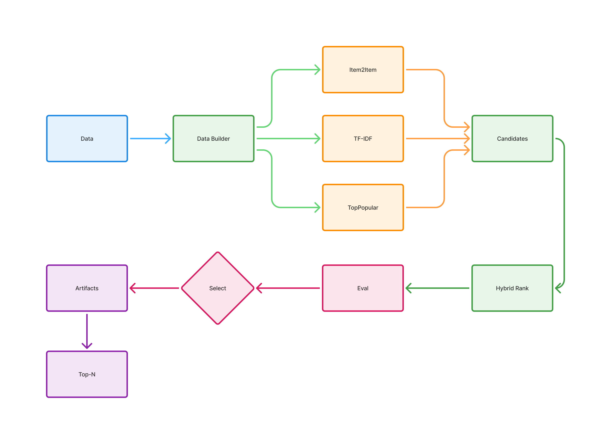

# ML System Design

### Документация проекта

- [Ссылка на ML System Design Doc](docs/ML_System_Design.md)
- [Итоги research (метрики, сравнение моделей, графики)](docs/Research_Results.md)

---

Этот проект про рекомендательную систему для книг Goodreads YA, где главная задача не только персонализировать выдачу, но и нормально работать с новыми книгами без истории. Мы строим MVP, который сравнивается с простыми ориентирами, чтобы честно понять, есть ли реальный прирост качества, а не просто «кажется стало лучше».

Фокус проекта на практичном пайплайне: подготовка данных, отдельная проверка для warm/cold книг, таблица метрик по подходам и понятный путь к A/B пилоту. Идея простая: сначала сделать устойчивое и воспроизводимое решение, а потом уже наращивать сложность, если это действительно дает бизнес-эффект.

---

## Текущий baseline

Сейчас в проекте реализуется базовый продуктовый `training pipeline` (resource-limited MVP) с несколькими источниками сигналов:

- `TopPopular` для стабильного baseline и fallback
- `Content TF-IDF` для cold-start по книгам
- `Item2Item CF` для персонализации на warm-истории
- `Hybrid` (`CF + Content + Popular`) как итоговая модель v1

Пайплайн обучает модели офлайн, считает `overall/warm/cold` метрики, сохраняет артефакты и готов к запуску в Docker как batch-job.

---