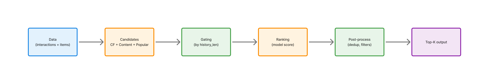

# ML System Design

### Документация проекта

- [Ссылка на ML System Design Doc](docs/ML_System_Design.md)
- [Итоги research (метрики, сравнение моделей, графики)](docs/Research_Results.md)

---

Проект посвящен рекомендательной системе для Goodreads YA с приоритетом на устойчивый cold-start по книгам: новые книги должны получать релевантные рекомендации даже при ограниченной истории взаимодействий.

Текущий фокус: построить воспроизводимый продуктовый pipeline, где отдельно контролируются warm/cold сегменты, а качество подтверждается прозрачными offline-метриками и артефактами запуска.

---

## Product Pipeline (MVP)

В системе используется двухэтапный подход: генерация кандидатов из нескольких источников и последующее объединение сигналов в итоговый ранжированный список.

Сигналы и модели:

- `TopPopular` — базовый baseline и fallback
- `Content TF-IDF` — основной источник для cold-item сценариев
- `Item2Item CF` — персонализация для warm-пользователей
- `Hybrid` (`CF + Content + Popular`) — итоговая модель MVP

Pipeline обучает модели офлайн, считает `overall/warm/cold` метрики, сохраняет артефакты (`models`, `reports`, `run_manifest`) и запускается как batch-job.



```text
Рекомендательный pipeline (end-to-end)

1) Data & Split
- Загрузка interactions + metadata
- Temporal split (train/val)
- Разметка сегментов: warm/cold items

2) Candidate Generation
- CF candidates (Item2Item) для warm history
- Content candidates (TF-IDF) для cold-item сценариев
- Popular/Trending fallback

3) Gating (segment-aware)
- history_len = 0 -> content + popular
- history_len = 1..5 -> content-heavy blend
- history_len > 5 -> CF-heavy blend

4) Hybrid Ranking
- Объединение сигналов: CF + Content + Popular
- Удаление seen items, дедуп кандидатов, top-K

5) Evaluation & Artifacts
- Метрики: NDCG@10, Recall@10, Coverage@10
- Срезы: overall / warm / cold
- Сохранение: models, reports, run_manifest
```

---
