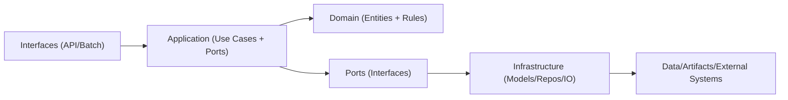

# ML System Design

### Документация проекта

- [Ссылка на ML System Design Doc](docs/ML_System_Design.md)
- [Итоги research (метрики, сравнение моделей, графики)](docs/Research_Results.md)

---

## Training Artifact Contract

Все запуски `train` сохраняются в `artifacts/runs/<run_id>/` по фиксированному контракту:

```text
artifacts/runs/<run_id>/
├── manifest.json            # schema_version=1.0.0, config hash, пути, метрики, тайминги
├── metrics.json             # итоговые offline-метрики
├── timings.json             # длительности шагов
├── train.log.jsonl          # структурированные события обучения
└── models/
    ├── stage1.pkl           # fitted Stage-1 источники (CF/content/pop)
    ├── stage2.json          # лучший конфиг PreRank
    ├── stage3.json          # конфиг FinalRank/Postprocess
    └── metrics_snapshot.json
```

Контракт централизован в:
- `source/application/use_cases/training/artifacts.py`

Тренировочные настройки берутся из `.env` (см. `.env.example`, префикс `BOOKRECS_TRAIN_*`) и могут быть переопределены CLI-флагами.

## Target Clean Architecture (from scratch)

```text
/Users/flexonafft/BookRecs
├── pyproject.toml
├── README.md
├── configs
│   ├── base.yaml
│   ├── train.yaml
│   ├── infer.yaml
│   └── ab_test.yaml
├── data
│   ├── raw
│   ├── processed
│   └── splits
├── artifacts
│   ├── models
│   ├── manifests
│   └── reports
├── src
│   └── bookrecs
│       ├── domain
│       │   ├── entities
│       │   │   ├── user.py
│       │   │   ├── book.py
│       │   │   ├── interaction.py
│       │   │   └── recommendation.py
│       │   ├── value_objects
│       │   │   ├── score.py
│       │   │   └── ranking_window.py
│       │   └── services
│       │       ├── business_rules.py
│       │       └── diversity_policy.py
│       ├── application
│       │   ├── ports
│       │   │   ├── candidate_source_port.py
│       │   │   ├── preranker_port.py
│       │   │   ├── final_ranker_port.py
│       │   │   ├── recommendation_repo_port.py
│       │   │   └── metrics_port.py
│       │   ├── use_cases
│       │   │   ├── generate_candidates.py
│       │   │   ├── pre_rank_candidates.py
│       │   │   ├── final_rank_and_postprocess.py
│       │   │   ├── get_recommendations.py
│       │   │   ├── get_similar_items.py
│       │   │   └── train_pipeline.py
│       │   └── dto
│       │       ├── requests.py
│       │       └── responses.py
│       ├── infrastructure
│       │   ├── data
│       │   │   ├── parquet_reader.py
│       │   │   └── feature_store.py
│       │   ├── models
│       │   │   ├── candidate_item2item.py
│       │   │   ├── candidate_content.py
│       │   │   ├── candidate_popular.py
│       │   │   ├── linear_preranker.py
│       │   │   └── final_ranker_hybrid.py
│       │   ├── repositories
│       │   │   ├── recommendation_repo.py
│       │   │   └── artifact_repo.py
│       │   └── observability
│       │       ├── logger.py
│       │       └── metrics.py
│       ├── interfaces
│       │   ├── api
│       │   │   ├── app.py
│       │   │   ├── routes_recommendations.py
│       │   │   └── routes_similar.py
│       │   └── batch
│       │       ├── train_job.py
│       │       ├── infer_job.py
│       │       └── export_job.py
│       └── main.py
├── tests
│   ├── unit
│   ├── integration
│   └── e2e
└── docs
    ├── architecture.md
    ├── ml_system_design.md
    └── api_contract.md
```


```mermaid
flowchart LR
UI["Interfaces (API/Batch)"] --> APP["Application (Use Cases + Ports)"]
APP --> DOM["Domain (Entities + Rules)"]
APP --> PORTS["Ports (Interfaces)"]
PORTS --> INFRA["Infrastructure (Models/Repos/IO)"]
INFRA --> DATA["Data/Artifacts/External Systems"]
```

Проект посвящен рекомендательной системе для Goodreads YA с приоритетом на устойчивый cold-start по книгам: новые книги должны получать релевантные рекомендации даже при ограниченной истории взаимодействий.

Текущий фокус: построить воспроизводимый продуктовый pipeline, где отдельно контролируются warm/cold сегменты, а качество подтверждается прозрачными offline-метриками и артефактами запуска.

---

## Product Pipeline (MVP)

В системе используется двухэтапный подход: генерация кандидатов из нескольких источников и последующее объединение сигналов в итоговый ранжированный список.

Сигналы и модели:

- `TopPopular` — базовый baseline и fallback
- `Content TF-IDF` — основной источник для cold-item сценариев
- `Item2Item CF` — персонализация для warm-пользователей
- `Hybrid` (`CF + Content + Popular`) — итоговая модель MVP

Pipeline обучает модели офлайн, считает `overall/warm/cold` метрики, сохраняет артефакты (`models`, `reports`, `run_manifest`) и запускается как batch-job.


```text
Рекомендательный pipeline (end-to-end)

1) Data & Split
- Загрузка interactions + metadata
- Temporal split (train/val)
- Разметка сегментов: warm/cold items

2) Candidate Generation
- CF candidates (Item2Item) для warm history
- Content candidates (TF-IDF) для cold-item сценариев
- Popular/Trending fallback

3) Gating (segment-aware)
- history_len = 0 -> content + popular
- history_len = 1..5 -> content-heavy blend
- history_len > 5 -> CF-heavy blend

4) Hybrid Ranking
- Объединение сигналов: CF + Content + Popular
- Удаление seen items, дедуп кандидатов, top-K

5) Evaluation & Artifacts
- Метрики: NDCG@10, Recall@10, Coverage@10
- Срезы: overall / warm / cold
- Сохранение: models, reports, run_manifest
```

---
