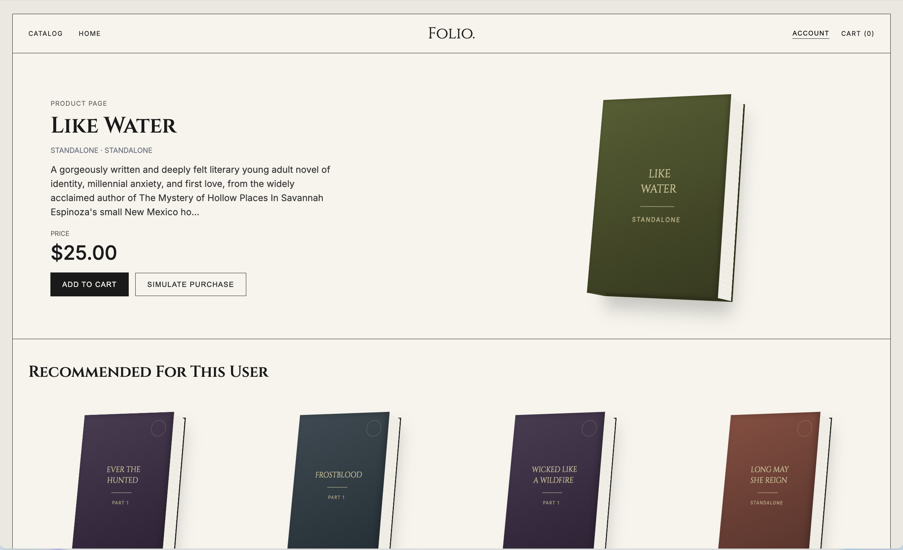
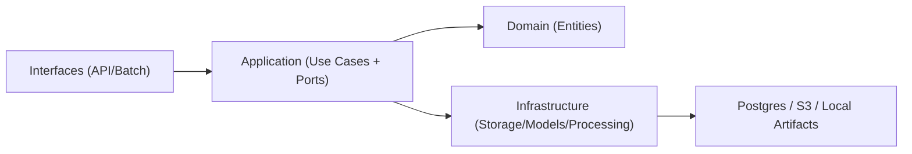

# BookRecs



## Описание проекта
BookRecs — это ML-система рекомендаций книг (Goodreads YA) с фокусом на гибридный pipeline и устойчивость к cold-start по айтемам. Проект объединяет подготовку данных, обучение моделей, офлайн-оценку и онлайн-инференс через FastAPI.

Система построена в стиле Clean Architecture: доменная модель и use-case логика отделены от инфраструктуры (PostgreSQL, S3/MinIO, docker-сервисы). На текущем этапе реализованы batch training pipeline и inference API, которые работают с сохраненными артефактами `stage1/stage2/stage3`.
Конфигурация приложения централизована в `source/infrastructure/config/settings.py` и читается через единый config layer на базе env-переменных.

## Ссылки на документацию проекта
- [ML System Design Doc](docs/ML_System_Design.md)
- [Research Results](docs/Research_Results.md)

## Product Pipeline


Pipeline состоит из пяти шагов:
1. `Data & Split` — загрузка и предобработка interactions/metadata, time split, разметка warm/cold.
2. `Candidate Generation` — объединение кандидатов из `CF`, `Content`, `Popular`.
3. `Pre-ranking` — легкий Stage-2 отбор top-M кандидатов.
4. `Final Ranking` — Stage-3 финальное ранжирование и postprocessing.
5. `Evaluation & Publish` — метрики (`NDCG@K`, `Recall@K`, `Coverage@K`, cold-срезы) и сохранение артефактов.

<details>
<summary><h2>Интерфейс демо</h2></summary>

### Главная страница


### Каталог рекомендаций


</details>

## Как запустить проект

### 1. Подготовка окружения
```bash
uv sync
make init-env
```

Проверь в `.env` ключевые параметры:
- `BOOKRECS_API_MODEL_URI` (например `artifacts/baselines/testmodel/models`)
- `BOOKRECS_PG_DSN`
- `BOOKRECS_S3_ENDPOINT`, `BOOKRECS_S3_BUCKET`
- `AWS_ACCESS_KEY_ID`, `AWS_SECRET_ACCESS_KEY`

### 2. Запуск инфраструктуры
```bash
make infra-up
```
Поднимутся `postgres`, `minio`, `minio-init`.

### 3. Запуск batch pipeline (опционально)
```bash
make pipeline-up
```

### 3.1 Обучение на уже предобработанном датасете
Если у вас уже есть каталог с `books.parquet`, `local_train.parquet`, `local_val.parquet`, можно пропустить `prepare` и запустить только обучение.

Пример:
```bash
BOOKRECS_TRAIN_DATASET_DIR=/absolute/path/to/goodreads_ya \
BOOKRECS_TRAIN_RUN_NAME=catboost_policy_v1 \
BOOKRECS_COLD_MAX_INTERACTIONS=5 \
make train-prepared
```

Команда монтирует каталог датасета в контейнер как `/dataset` и запускает только training entrypoint.

При необходимости можно дополнительно передать параметры обучения через env:
```bash
BOOKRECS_TRAIN_DATASET_DIR=/absolute/path/to/goodreads_ya \
BOOKRECS_TRAIN_RUN_NAME=catboost_policy_v1 \
BOOKRECS_COLD_MAX_INTERACTIONS=5 \
BOOKRECS_TRAIN_CANDIDATE_POOL_SIZE=1200 \
BOOKRECS_TRAIN_PER_SOURCE_LIMIT=350 \
BOOKRECS_TRAIN_PRE_TOP_M=300 \
BOOKRECS_TRAIN_FINAL_TOP_K=10 \
make train-prepared

Для слабой машины или MacBook можно использовать облегченный режим:
```bash
BOOKRECS_TRAIN_DATASET_DIR=/absolute/path/to/goodreads_ya \
make train-lite-prepared
```

`lite`-профиль уменьшает candidate pool, лимиты соседей и историю для `CF`, а Stage 2 переключает на `LinearPreRanker` вместо `CatBoost`.

Для обычного запуска теперь можно использовать авто-подбор профиля:
```bash
BOOKRECS_TRAIN_DATASET_DIR=/absolute/path/to/goodreads_ya \
make train-auto
```

`auto` по памяти контейнера выбирает `lite`, если лимит памяти не больше `8 GB`, иначе использует `default`. Ручные env-переопределения по-прежнему имеют приоритет.
```

### 3.1 Эмуляция batch за 5 дней (offline replay / пилот)
```bash
make batch-emulate DAYS=5 END_DATE=2026-03-10
```
Если `END_DATE` не задан, берется текущая дата; для каждого дня запускается отдельный batch run с `run_name=batch_YYYYMMDD`, после чего выполняется promote активной модели.

### 3.2 Ручной promote модели
```bash
make promote-run RUN_NAME=batch_20260310
```

### 4. Запуск API инференса
```bash
make api-up
```

### 5. Проверка API
```bash
curl http://localhost:8000/healthz
curl -X POST http://localhost:8000/v1/admin/reload-model
```

### Полезные команды
```bash
make ps
make logs SERVICE=api
make logs SERVICE=pipeline
make demo-seed
make batch-emulate DAYS=5 END_DATE=2026-03-10
make promote-run RUN_NAME=batch_20260310
make test
make down
make down-volumes
```

`make demo-seed` загружает demo-таблицы для фронтенда в PostgreSQL из preprocessed датасета:
- источник по умолчанию: `artifacts/tmp_preprocessed/goodreads_ya`
- миграции: `source/infrastructure/storage/postgres/migrations`
- лимиты по умолчанию:
  - `BOOKRECS_DEMO_USERS_LIMIT=2000`
  - `BOOKRECS_DEMO_MAX_HISTORY_PER_USER=100`
  - `BOOKRECS_DEMO_RESET=true`

### Локальный запуск без docker compose
```bash
uv run python -m source.interfaces.pipeline_entrypoint
uv run python -m source.interfaces.train_entrypoint
uv run python -m source.interfaces.api_entrypoint
uv run python -m source.interfaces.batch_backfill_entrypoint
```

<details>
<summary><h2>Airflow Batch DAG</h2></summary>

В проект добавлен DAG `bookrecs_daily_batch` (файл `source/interfaces/airflow/dags/bookrecs_batch_dag.py`) с `DockerOperator` и `catchup=True`.
Он включает два шага:
1. `run_batch_pipeline`
2. `promote_model`

Пример backfill в Airflow за 5 дней:
```bash
airflow dags backfill bookrecs_daily_batch -s 2026-03-06 -e 2026-03-10
```

</details>

<details>
<summary><h2>Active Model Flow</h2></summary>

- Активная модель хранится в pointer-файле `BOOKRECS_ACTIVE_MODEL_POINTER` (по умолчанию `artifacts/runs/active_model.json`).
- API при старте и в рантайме читает pointer и подхватывает новую модель.
- Интервал автопроверки: `BOOKRECS_API_MODEL_AUTO_RELOAD_SEC` (по умолчанию 60 сек).
- Принудительное обновление без рестарта: `POST /v1/admin/reload-model`.

</details>

<details>
<summary><h2>Architecture</h2></summary>

Текущая структура проекта:

```text
BookRecs/
├── source/
│   ├── domain/                 # сущности и доменные модели
│   ├── application/            # use-cases и порты
│   ├── infrastructure/         # storage, ranking, preprocessing, inference
│   ├── interfaces/             # entrypoints: pipeline + api
│   └── tests/
├── docs/                       # проектная документация
├── artifacts/                  # модели и артефакты запусков
├── data/                       # raw/data assets
├── docker-compose.yml
├── Dockerfile
└── README.md
```

Слои взаимодействуют так:


```mermaid
flowchart LR
UI["Interfaces (API/Batch)"] --> APP["Application (Use Cases + Ports)"]
APP --> DOM["Domain (Entities)"]
APP --> INFRA["Infrastructure (Storage/Models/Processing)"]
INFRA --> EXT["Postgres / S3 / Local Artifacts"]
```

</details>

<details>
<summary><h2>Artifacts</h2></summary>

### Training run artifacts
Каждый run обучения сохраняется в каталоге:

```text
artifacts/runs/<run_id>/
├── manifest.json
├── metrics.json
├── timings.json
├── train.log.jsonl
└── models/
    ├── stage1.pkl
    ├── stage2.pkl
    ├── stage3.pkl
    └── metrics_snapshot.json
```

### Baseline/test artifacts
Для быстрых запусков и smoke-тестов используется:

```text
artifacts/baselines/testmodel/
└── models/
    ├── stage1.pkl
    ├── stage2.pkl
    ├── stage3.pkl
    └── metrics_snapshot.json
```

### Prepared dataset artifacts
После `prepare` сохраняются:

```text
artifacts/tmp_preprocessed/goodreads_ya/
├── books.parquet
├── train.parquet
├── test.parquet
├── local_train.parquet
├── local_val.parquet
├── local_val_warm.parquet
├── local_val_cold.parquet
├── summary.json
└── manifest.json
```

</details>
