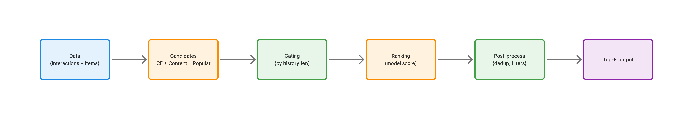
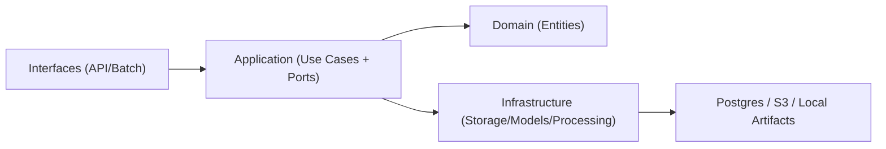

# BookRecs

## Описание проекта
BookRecs — это ML-система рекомендаций книг (Goodreads YA) с фокусом на гибридный pipeline и устойчивость к cold-start по айтемам. Проект объединяет подготовку данных, обучение моделей, офлайн-оценку и онлайн-инференс через FastAPI.

Система построена в стиле Clean Architecture: доменная модель и use-case логика отделены от инфраструктуры (PostgreSQL, S3/MinIO, docker-сервисы). На текущем этапе реализованы batch training pipeline и inference API, которые работают с сохраненными артефактами `stage1/stage2/stage3`.

## Ссылки на документацию проекта
- [ML System Design Doc](docs/ML_System_Design.md)
- [Research Results](docs/Research_Results.md)

<details>
<summary><h2>Как запустить проект</h2></summary>

### 1. Подготовка окружения
```bash
make init-env
```

Проверь в `.env` ключевые параметры:
- `BOOKRECS_API_MODEL_URI` (например `artifacts/baselines/testmodel/models`)
- `BOOKRECS_PG_DSN`
- `BOOKRECS_S3_ENDPOINT`, `BOOKRECS_S3_BUCKET`
- `AWS_ACCESS_KEY_ID`, `AWS_SECRET_ACCESS_KEY`

### 2. Запуск инфраструктуры
```bash
make infra-up
```
Поднимутся `postgres`, `minio`, `minio-init`.

### 3. Запуск batch pipeline (опционально)
```bash
make pipeline-up
```

### 4. Запуск API инференса
```bash
make api-up
```

### 5. Проверка API
```bash
curl http://localhost:8000/healthz
```

### Полезные команды
```bash
make ps
make logs SERVICE=api
make logs SERVICE=pipeline
make test
make down
make down-volumes
```

### Локальный запуск без docker compose
```bash
python -m source.interfaces.pipeline_entrypoint
python -m source.interfaces.api_entrypoint
```

### Основные API эндпоинты
- `GET /healthz`
- `POST /v1/recommendations`
- `GET /v1/items/{item_id}/similar`
- `POST /v1/interactions`

Пример inference-запроса:
```bash
curl -X POST http://localhost:8000/v1/recommendations \
  -H "Content-Type: application/json" \
  -d '{
    "user_id": "u_42",
    "top_k": 10,
    "seen_items": [12, 24, 36],
    "use_history": true
  }'
```

</details>

## Product Pipeline


Pipeline состоит из пяти шагов:
1. `Data & Split` — загрузка и предобработка interactions/metadata, time split, разметка warm/cold.
2. `Candidate Generation` — объединение кандидатов из `CF`, `Content`, `Popular`.
3. `Pre-ranking` — легкий Stage-2 отбор top-M кандидатов.
4. `Final Ranking` — Stage-3 финальное ранжирование и postprocessing.
5. `Evaluation & Publish` — метрики (`NDCG@K`, `Recall@K`, `Coverage@K`, cold-срезы) и сохранение артефактов.

<details>
<summary><h2>Architecture</h2></summary>

Текущая структура проекта:

```text
BookRecs/
├── source/
│   ├── domain/                 # сущности и доменные модели
│   ├── application/            # use-cases и порты
│   ├── infrastructure/         # storage, ranking, preprocessing, inference
│   └── interfaces/             # entrypoints: pipeline + api
├── docs/                       # проектная документация
├── artifacts/                  # модели и артефакты запусков
├── data/                       # raw/data assets
├── docker-compose.yml
├── Dockerfile
└── README.md
```

Слои взаимодействуют так:


```mermaid
flowchart LR
UI["Interfaces (API/Batch)"] --> APP["Application (Use Cases + Ports)"]
APP --> DOM["Domain (Entities)"]
APP --> INFRA["Infrastructure (Storage/Models/Processing)"]
INFRA --> EXT["Postgres / S3 / Local Artifacts"]
```

</details>

<details>
<summary><h2>Artifacts</h2></summary>

### Training run artifacts
Каждый run обучения сохраняется в каталоге:

```text
artifacts/runs/<run_id>/
├── manifest.json
├── metrics.json
├── timings.json
├── train.log.jsonl
└── models/
    ├── stage1.pkl
    ├── stage2.pkl
    ├── stage3.pkl
    └── metrics_snapshot.json
```

### Baseline/test artifacts
Для быстрых запусков и smoke-тестов используется:

```text
artifacts/baselines/testmodel/
└── models/
    ├── stage1.pkl
    ├── stage2.pkl
    ├── stage3.pkl
    └── metrics_snapshot.json
```

### Prepared dataset artifacts
После `prepare` сохраняются:

```text
artifacts/tmp_preprocessed/goodreads_ya/
├── books.parquet
├── train.parquet
├── test.parquet
├── local_train.parquet
├── local_val.parquet
├── local_val_warm.parquet
├── local_val_cold.parquet
├── summary.json
└── manifest.json
```

</details>
