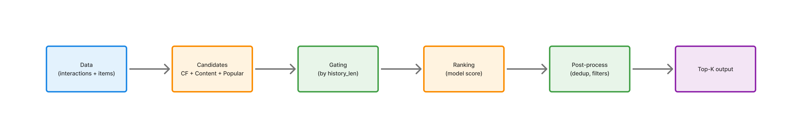

# BookRecs


BookRecs — это ML-система рекомендаций книг на датасете Goodreads YA. Проект реализует гибридный recommendation pipeline с упором на персонализацию, устойчивость к cold-start по книгам и простой online inference через FastAPI.

## Что умеет проект
- строить персональные рекомендации книг;
- использовать трехступенчатый pipeline: `candidate generation -> pre-ranking -> final ranking`;
- учитывать cold-start по item через гибридный подход;
- считать офлайн-метрики качества (`NDCG`, `Recall`, `Coverage`, warm/cold-срезы);
- поднимать API для inference и демо-сценариев.

## Документация
- [ML System Design Doc](docs/ML_System_Design.md)
- [Research Results](docs/Research_Results.md)

## Recommendation Pipeline


Pipeline состоит из пяти шагов:
1. `Data & Split` — подготовка interactions и metadata, split, разметка warm/cold.
2. `Candidate Generation` — объединение кандидатов из `CF`, `Content`, `Popular`.
3. `Pre-ranking` — быстрый отбор top-M кандидатов.
4. `Final Ranking` — финальное ранжирование и post-processing.
5. `Evaluation` — расчет офлайн-метрик и сравнение с baseline.

<details>
<summary><h2>Демо-интерфейс</h2></summary>

### Главная страница


### Каталог рекомендаций


</details>

## Быстрый старт

### 1. Подготовка
```bash
uv sync
make init-env
```

После этого проверь `.env`. Для локального запуска чаще всего важны:
- `BOOKRECS_TRAIN_DATASET_DIR`
- `BOOKRECS_PG_DSN`
- `BOOKRECS_S3_ENDPOINT`
- `BOOKRECS_S3_BUCKET`
- `AWS_ACCESS_KEY_ID`
- `AWS_SECRET_ACCESS_KEY`

### 2. Поднять инфраструктуру
```bash
make infra-up
```

Поднимутся:
- `postgres`
- `minio`
- `minio-init`

### 3. Обучить модель

Если у тебя уже есть подготовленный датасет, самый простой сценарий такой:

```bash
BOOKRECS_TRAIN_DATASET_DIR=/absolute/path/to/goodreads_ya \
make train-auto
```

Если машина слабая, можно использовать облегченный режим:

```bash
BOOKRECS_TRAIN_DATASET_DIR=/absolute/path/to/goodreads_ya \
make train-lite-prepared
```

### 4. Запустить API
```bash
make api-up
```

### 5. Проверить, что сервис работает
```bash
curl http://localhost:8000/healthz
curl http://localhost:8000/readyz
```

## Как использовать API

### Проверка статуса
```bash
curl http://localhost:8000/healthz
curl http://localhost:8000/readyz
```

### Получить рекомендации
```bash
curl -X POST http://localhost:8000/recommendations \
  -H "Content-Type: application/json" \
  -d '{
    "user_id": "demo-user",
    "top_k": 10
  }'
```

## Полезные команды

```bash
make infra-up           # поднять postgres + minio
make api-up             # запустить inference API
make train-auto         # обучить модель с авто-подбором профиля
make train-lite-prepared # облегченный train для слабой машины
make demo-seed          # загрузить demo-таблицы в postgres
make ps                 # статус контейнеров
make logs SERVICE=api   # смотреть логи
make test               # unit-тесты
make down               # остановить сервисы
make down-volumes       # остановить сервисы и удалить volumes
```

## Запуск демо-данных

Если хочешь посмотреть демо-сценарий во фронтенде или в базе:

```bash
make demo-seed
```

По умолчанию команда:
- берет подготовленные parquet-файлы;
- заполняет demo-таблицы в PostgreSQL;
- прогоняет миграции, если это разрешено конфигом.

## Локальный запуск без Docker Compose

Если нужно запускать entrypoint-ы напрямую:

```bash
uv run python -m source.interfaces.train_entrypoint
uv run python -m source.interfaces.api_entrypoint
uv run python -m source.interfaces.pipeline_entrypoint
uv run python -m source.interfaces.batch_backfill_entrypoint
```

## Структура проекта

```text
BookRecs/
├── source/
│   ├── domain/          # доменные сущности
│   ├── application/     # use-cases и порты
│   ├── infrastructure/  # storage, ranking, preprocessing, inference
│   ├── interfaces/      # API и entrypoints
│   └── tests/
├── docs/                # документация
├── frontend/            # demo UI
├── artifacts/           # локальные модели и результаты запусков
├── data/                # данные и служебные assets
├── docker-compose.yml
├── Makefile
└── README.md
```
