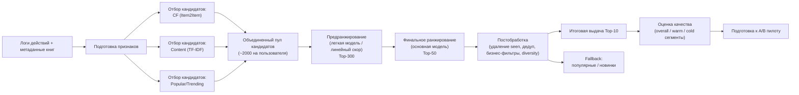

# ML System Design Doc
## Дизайн ML-системы: персональные рекомендации новинок в ленте BookRecs (Goodreads YA)

### 1. Цели и предпосылки 
#### 1.1. Зачем идем в разработку продукта?  

- **Бизнес-цель**  
  Сейчас пользователю сложно быстро найти «свою» книгу из большого каталога → он тратит время или уходит без покупки. Мы хотим упростить этот выбор с помощью рекомендаций. **Что это дает бизнесу:**

  - увеличиваем выручку за счёт более релевантных предложений;
  - повышаем конверсию (пользователь быстрее находит, что купить);
  - помогаем продавать не только бестселлеры, но и новинки + возможно получится продать книги, которые давно лежат на складе, как "непопулярные";
  

- **Почему использование ML улучшит текущее решение?**
  Проекты, которые используют рекомендации без ML, обычно используют подход (популярное / новинки) и имеют ряд минусов: одинаковые рекомендации для всех пользователей, не учитываются личные предпочтения, не находятся менее очевидные, но релевантные книги.

  **Что может дать ML:**

  - персонализация — рекомендации под конкретного пользователя;
  - лучшее попадание в интересы, что увеличивает вероятность покупки;
  - возможность находить менее очевидные, но релевантные книги;

- **Что считаем успехом итерации с точки зрения бизнеса**  
  Успех оцениваем через A/B тест: сравниваем новую систему рекомендаций с текущей и смотрим, меняется ли поведение пользователей. В первую очередь ожидаем, что пользователи начнут чаще покупать — это должно отражаться в росте выручки на сессию и среднего чека. Дополнительно смотрим на более простые сигналы: кликают ли пользователи на рекомендации, чаще ли с ними взаимодействуют и быстрее ли находят подходящую книгу.

  При этом важно, чтобы мы не ухудшили базовый опыт: конверсия в покупку не должна падать, возвраты — расти, а система — становиться заметно медленнее. Если пользователи активнее взаимодействуют с рекомендациями, чаще покупают, и при этом ключевые метрики остаются стабильными, считаем решение успешным.

#### 1.2. Бизнес-требования и ограничения  

- **Краткое описание БТ**

  Мы хотим показывать пользователям персональные рекомендации:
  - предлагать книги, которые могут им понравиться (на основе их интересов и поведения);
  - показывать «похожие книги» на странице конкретной книги;
  За счет этого увеличивать продажи 
 
- **Бизнес-ограничения**

  - Не стоит рекомендовать книги, которых нет в наличии;
  - Желательно объяснять пользователю, почему ему это показали (например: «похоже по жанру» или «из той же серии»); 
  
- **Что ожидаем от текущей итерации**

  - Делаем базовую версию (MVP) рекомендаций
  - Показываем их в нескольких местах: например, на главной, на странице книги и в корзине
  - Проверяем MVP в формате эмулированного пилота (`offline replay`: `control vs test`)
  - Фиксируем офлайн-метрики и критерии допуска в следующий этап
  - Готовим дизайн целевого `online A/B` как roadmap (контроль/тест, метрики, условия успеха)
  - Готовим возможность быстро откатиться, если пилот пойдёт не так

- **Как проходит пилот?**

  - В текущей итерации (фактический формат): эмулированный пилот `offline replay`
    - контроль: действующий baseline;
    - тест: трехступенчатый MVP;
    - сравнение по фиксированному holdout-набору и единому протоколу метрик.

  - В следующей итерации (целевой формат): `online A/B`
    - показываем блок с рекомендациями в реальном трафике;
    - фиксируем показы, клики и покупки;
    - считаем эффект на уровне пользователя/сессии.
     
- **Когда считаем пилот успешным**

  - Для текущей итерации (`offline replay`): модель допускается дальше, если выполняются пороги по `NDCG@10`, `Recall@10`, `ColdNDCG@10`, `ColdRecall@10` и нет критичной деградации warm-среза.
  - Для следующей итерации (`online A/B`): пилот успешен, если растет выручка на сессию, при этом не ухудшается доля сессий с покупкой и система работает стабильно.

- **Бизнес-метрики текущей итерации (простыми словами)**

  - **Выручка на сессию**  
    Что показывает: сколько денег в среднем приносит один визит.  
    Зачем нужна: это главный показатель, растет ли доход от рекомендаций.

  - **Конверсия в покупку**  
    Что показывает: какая доля визитов заканчивается покупкой.  
    Зачем нужна: помогает понять, действительно ли рекомендации приводят к покупке, а не только к просмотрам.

  - **Средний чек**  
    Что показывает: на какую сумму в среднем оформляют заказ.  
    Зачем нужна: видно, помогают ли рекомендации покупать больше или более дорогие книги.

  - **Доля заказов с рекомендованной книгой**  
    Что показывает: в какой части заказов есть хотя бы одна книга из блока рекомендаций.  
    Зачем нужна: показывает прямой вклад рекомендаций в продажи.

  - **Клики по блоку рекомендаций**  
    Что показывает: как часто пользователи открывают рекомендованные книги.  
    Зачем нужна: ранний сигнал полезности; если кликов нет, дальше покупок тоже обычно мало.

#### 1.3. Что входит в скоуп проекта/итерации, что не входит   

- **Что закрываем в текущей итерации**

  В этой итерации собираем рабочий MVP рекомендаций для книжного интернет-магазина: персональные user2item рекомендации с устойчивостью к cold-start у книг.

  В рамках итерации:
  - реализуем трехступенчатую рекомендательную систему: отбор кандидатов -> предранжирование -> финальное ранжирование + постобработка;
  - используем несколько источников кандидатов (`Item2Item`, `Content TF-IDF`, `Popular/Trending`), чтобы не терять cold-книги;
  - на этапе предранжирования сокращаем пул кандидатов до управляемого размера, на финальном ранжировании формируем точный `top-N`;
  - считаем обязательные метрики: `NDCG@10`, `Recall@10`, `Coverage@10` и отдельные cold-метрики (`ColdNDCG@10`, `ColdRecall@10`);
  - делаем валидацию отдельно для warm и cold книг, чтобы не маскировать ошибки на cold-сегменте;
  - сохраняем обученные модели и артефакты запуска/инференса (метрики, конфиг, manifest; при необходимости — выгрузки рекомендаций);
  - готовим выдачу top-N рекомендаций для блока в интерфейсе и запасной вариант: если модель недоступна, показываем популярные или новые книги.

- **Какие бизнес-требования закрывает текущая итерация**
  - появляется персонализация вместо одинаковой выдачи для всех;
  - новые книги не теряются в выдаче: модель умеет рекомендовать cold-start айтемы;
  - есть сравнение с бейзлайном по метрикам и таблица результатов;
  - подготовлены материалы для запуска A/B-пилота: контрольный и тестовый сценарии, список целевых и защитных метрик.

- **Что остается вне текущей итерации**
  - не оптимизируем «до идеала» latency и стоимость (делаем разумный MVP уровень);
  - не делаем explainability «как в зрелом продукте» (только базовые причины показа);
  - не закрываем cold-start пользователей (в тесте соревнования только warm пользователи);
  - не делаем полноценный онлайн-контур переобучения в реальном времени;
  - не добавляем cold-start юзеров.

- **Требования к результату (качество кода и воспроизводимость)**
  - весь пайплайн воспроизводим: фиксируем `random seed`, версии библиотек и сплиты;
  - обучение, инференс и оценка разделены на отдельные шаги;
  - есть единая таблица метрик по всем подходам и отдельный срез по cold айтемам;
  - все ключевые гиперпараметры и конфиги вынесены в явный вид;
  - сохранение/загрузка моделей, чтобы результаты можно было повторить без переобучения.

#### 1.4. Предпосылки решения  

- **Базовые предпосылки решения**
  - задача формулируется как персонализированный `top-N` ranking (а не прогноз рейтинга книги в абсолютных баллах);
  - целевой эффект для бизнеса — рост покупки через более релевантные рекомендации, поэтому оптимизируем ранжирование и покрытие каталога;
  - в данных много разреженности, а у части книг нет истории, поэтому чисто collaborative подход недостаточен — нужен гибрид.

- **Какие блоки данных используем**
  - в текущем MVP (Goodreads YA) используем `user_id x item_id` interactions с доступными полями `is_read`, `rating`, `date_added` и производными признаками;
  - событийные продуктовые логи уровня `impression -> click -> add_to_cart -> purchase` в текущем MVP/пилоте не используются и относятся к roadmap для следующих итераций (после появления продуктового логирования);
  - справочник книг: жанры, авторы, серия, описание, год, язык и прочие метаданные;
  - служебные признаки для фильтров: доступность/наличие, язык, базовые бизнес-ограничения.

- **Горизонт и частота пересчёта**
  - прогноз как таковой не строим, считаем релевантность «на ближайший показ» (next best books в текущем сеансе/визите);
  - переобучение MVP: батчево (например, раз в день/несколько дней), без realtime online-learning;
  - фичи пользователя пересчитываются с упором на recent историю, чтобы не терять актуальные интересы.

- **Гранулярность модели**
  - сущности уровня `user_id x item_id` (книга);
  - выдача в формате `top-N` (обычно `N=10`) на пользователя/контекст показа;
  - оценка качества отдельно по всему каталогу и отдельно по cold-item сегменту.

- **Предпосылки по данным и экспериментам**
  - тестовый набор фиксированный и не изменяется;
  - в тесте есть cold и warm книги, но пользователи warm, поэтому делаем акцент на item cold-start;
  - метрики считаем на одинаковом протоколе для всех моделей, чтобы сравнение было честным;
  - успех MVP формулируем относительно бейзлайна, а не «в вакууме».

- **Разделение продуктового и research контуров**
  - в рамках контура тестирования (research) используем фиксированный датасет Goodreads YA и считаем офлайн-метрики;
  - в рамках продуктового контура (пилот/production) целевым развитием являются `impression`-логи, A/B-инфраструктура, данные о наличии и технические метрики сервиса;
  - требования к пилоту и production в этом документе описаны как проектный дизайн.

- **Ограничения MVP, которые принимаем осознанно**
  - если в части событий нет стабильного user_id (или он меняется), такие события не используем для обучения персональной модели; в MVP обучаемся только на надёжно идентифицируемых взаимодействиях;
  - в MVP реализуем базовую объяснимость рекомендаций (например, по жанру, автору или похожим книгам) без отдельного сложного explanation-сервиса;
  - при недоступности или деградации модели автоматически переключаемся на fallback-выдачу (популярное/новинки), чтобы сохранить стабильный пользовательский опыт.

### 2. Методология решения    

#### 2.1. Постановка задачи  

- С технической стороны делаем **персональную рекомендательную систему книг** (задача ранжирования), а не прогноз продаж и не поиск аномалий.
- Для каждого пользователя формируем список `top-10` книг, которые с наибольшей вероятностью заинтересуют его сейчас.
- Учитываем два режима:
  - **warm-книги**: у книги есть не меньше `k` взаимодействий до даты разделения (`k` фиксируем в эксперименте, например `k=5`); Warm/cold-статус книги определяется по числу взаимодействий в обучающем периоде (до даты split). Порог k фиксируется до запуска экспериментов и одинаков для всех моделей.
  - **cold-книги**: у книги меньше `k` взаимодействий до даты разделения (включая `0`).
- Основная цель модели: улучшить качество рекомендаций относительно простых ориентиров и не провалиться на cold-start книгах.
- Единица предсказания: пара `пользователь × книга`.
- Целевой сигнал для текущего MVP (Goodreads YA): взаимодействия `is_read`, `rating`, `date_added`; на их основе считаем вес взаимодействия для обучения.
- Для воспроизводимости заранее фиксируем схему веса взаимодействия, используемую в коде (текущая версия): `interaction_weight = 1.0 + 0.25 * rating + 0.5 * is_read` (с clipping/очисткой некорректных значений); протокол финальной офлайн-оценки (NDCG/Recall/Coverage) фиксируется отдельно и одинаков для всех моделей.

#### 2.2. Блок-схема решения  

- Ниже целевая схема MVP.

- В этой схеме используем трехступенчатую рекомендательную архитектуру:
  1) отбор кандидатов,
  2) предранжирование,
  3) финальное ранжирование + постобработка.

#### 2.3. Этапы решения задачи  

- Ниже план работ по этапам для MVP.

**Этап 1. Подготовка данных и проверка качества**

| Данные | Откуда берем | Нужны для | Проверки качества |
| --- | --- | --- | --- |
| История взаимодействий пользователя (Goodreads YA: `is_read`, `rating`, `date_added`) | датасет Goodreads YA | обучение и офлайн-оценка | пропуски, дубли, корректность времени, валидность `rating` |
| Метаданные книг (жанр, автор, серия, описание, язык, год) | Goodreads YA metadata / каталог книги | контентные признаки и cold-item сценарий | заполненность полей, нормализация категорий, шум |
| Служебные признаки (`is_cold_item`, границы train/valid/test) | формируем в preprocessing | честная сегментная оценка | отсутствие leakage, стабильность порога `k`, воспроизводимость split |

- Готовим признаки пользователя и книги.
- Контролируем, что cold-книги не теряются на этапе подготовки.

**Этап 2. Ступень 1 — отбор кандидатов (candidate generation)**

- Собираем кандидатов из нескольких источников:
  - `Item2Item CF`,
  - `Content TF-IDF`,
  - `Popular/Trending`,
  - при необходимости — кандидаты по авторам/сериям/тегам.
- Объединяем источники в единый пул `~1500–3000` кандидатов на пользователя.
- Выход этапа:
  - `candidate_table` с `user_id`, `item_id`, `source`, `raw_score`.
- Риск:
  - слабый охват cold-книг.
- Как снижаем риск:
  - выделяем отдельный cold-aware источник кандидатов (content).

**Этап 3. Ступень 2 — предранжирование (pre-ranking)**

- Цель:
  - быстро отсеять шум и сократить пул кандидатов до `~200–300`.
- Легкая модель (например, логистическая регрессия/линейный скор) по признакам:
  - `score_cf`, `score_content`, `score_pop`,
  - `history_len`, `is_cold_item`, `source`.
- Выход этапа:
  - сокращенный список кандидатов для финального ранжирования.

**Этап 4. Ступень 3 — финальное ранжирование (final ranking)**

- Основная модель ранжирования на сокращенном пуле.
- Используем признаки поведения + контента + популярности.
- Приоритет: максимальная точность в `top-10`.
- Выход этапа:
  - финальный score кандидатов перед выдачей.
- Риск:
  - улучшение warm-качества ценой провала на cold.
- Как снижаем риск:
  - отдельно контролируем cold-метрики и вводим cold-item защиту в ранжировании.

**Этап 5. Постобработка и формирование выдачи**

- Удаляем уже просмотренные книги.
- Применяем бизнес-фильтры (например, наличие).
- Делаем дедуп и ограничение однотипных книг.
- Формируем итоговый `top-10`.
- Если основной контур недоступен, включаем fallback (`популярные/новинки`).

**Этап 6. Оценка качества и подготовка к пилоту**

- Метрики:
  - `NDCG@10`, `Recall@10`, `Coverage@10`;
  - `ColdNDCG@10`, `ColdRecall@10`;
  - срезы: `overall / warm / cold`.
- Оцениваем трехступенчатый MVP на фиксированном протоколе.
- Прирост по cold-метрикам — обязательное условие качества.
- Выход этапа:
  - единая таблица результатов;
  - зафиксированный пакет артефактов для пилота (модели, конфиги, отчеты, условия отката).
  
### 3. Подготовка пилота  

> Ниже описан целевой формат продуктового пилота. В рамках текущей итерации на датасете Goodreads YA пилот и событийное логирование уровня `impression/click/add_to_cart/purchase` не реализуются и рассматриваются как roadmap для следующего этапа.
>
> В текущей итерации пилот выполняется как **эмуляция (offline replay)**, так как нет интернет-магазина и реального пользовательского трафика. Поэтому разделы 3.1-3.3 ниже фиксируют целевой online A/B-дизайн для следующего этапа, а фактическая проверка сейчас делается офлайн как сравнение `control vs test` на фиксированном holdout-наборе.
  
#### 3.1. Способ оценки пилота  

- В этой итерации сравниваем именно трехступенчатый MVP-контур из пункта 2:
  - **ступень 1**: отбор кандидатов (`Item2Item + Content + Popular/Trending`);
  - **ступень 2**: предранжирование (быстрое сокращение пула);
  - **ступень 3**: финальное ранжирование + постобработка и выдача `top-10`.

- Текущий формат проверки (сейчас):
  - **offline replay** на фиксированном holdout-наборе;
  - **контроль**: действующий baseline;
  - **тест**: трехступенчатый MVP;
  - сравнение качества по одинаковому протоколу метрик и срезов.

- Целевой продуктовый формат (следующий этап):
  - онлайн A/B тест на реальном трафике;
  - пользователь закреплен за группой на весь период эксперимента;
  - эффект считаем на уровне пользователя/сессии.

- Для согласованности с архитектурой из пункта 2 перед запуском фиксируем операционные проверки:
  - размер пула после ступени 1 (отбор кандидатов);
  - размер пула после ступени 2 (предранжирование);
  - долю пустых выдач после ступени 3;
  - время ответа по ступеням и суммарно.
  
#### 3.2. Что считаем успешным пилотом  

Критерии успеха

1) Успех на offline (до пилота)
- Новая 3-ступенчатая система лучше текущей по `NDCG@10` и `Recall@10`.
- По cold-книгам есть рост `ColdNDCG@10` и `ColdRecall@10` (это обязательно).
- `Coverage@10` не падает ниже согласованного минимума.
- По warm-книгам нет заметного ухудшения.

2) Успех на online A/B (в пилоте)
- Выручка на сессию в тесте выше контроля не меньше чем на целевой порог (`MDE`).
- Доля сессий с покупкой не ухудшается.
- Клики по блоку рекомендаций не ухудшаются.
- Система работает стабильно: задержка и ошибки в допустимых пределах.

3) Техническая проверка 3 ступеней
- После отбора кандидатов список достаточно большой.
- После предранжирования остается достаточно разных книг.
- После финального ранжирования и фильтров у пользователя всегда есть непустой `top-10`.

Если все условия выше выполняются, расширяем пилот на большую долю трафика.
  
#### 3.3. Подготовка пилота  

- Подготовка пилота строится по ступеням новой архитектуры:
  - готовим артефакты отбора кандидатов (правила, параметры, источники);
  - готовим артефакты предранжирования (модель/веса, порог отсечения);
  - готовим артефакты финального ранжирования и постобработки (модель, фильтры, дедуп, fallback).

- Что фиксируем до запуска:
  - версию трехступенчатого контура и все параметры ступеней;
  - целевые размеры пулов по ступеням (`top-N` после 1-й и 2-й ступени);
  - правила бизнес-фильтров и резервный сценарий (`популярные/новинки`);
  - единый шаблон отчета по метрикам и срезам (`overall/warm/cold`).

- Ограничения MVP:
  - батчевый пересчет без сложного online-learning;
  - ограничиваем число признаков и размер пулов, чтобы удержать расчет в разумное время;
  - запускаем сначала на ограниченной доле трафика, затем масштабируем.

- План запуска:
  - шаг 1: технический прогон и проверка корректности всех 3 ступеней;
  - шаг 2: сравнение `control vs test` в `offline replay` (обязательный этап текущей итерации);
  - шаг 3: решение о допуске в `online A/B` (следующий этап, при наличии трафика);
  - шаг 4: ограниченный продуктовый запуск и финальный анализ: масштабируем / дорабатываем / откатываем.

### 4. Внедрение в production (опционально)    

> Этот раздел нужен, когда решение планируется выводить в production. Для текущей итерации его можно рассматривать как план следующего этапа: как подключать сервис, масштабировать инфраструктуру и контролировать риски после запуска.  
  
#### 4.1. Архитектура решения   
  
- Для прод-варианта используем трехступенчатую схему: отбор кандидатов, предранжирование и финальное ранжирование с постобработкой.
- Основные блоки:
  - **Сервис рекомендаций**: принимает запрос от продукта и возвращает `top-N` книг.
  - **Хранилище признаков/витрина**: хранит подготовленные признаки пользователей и книг.
  - **Сервис кандидатов**: быстро собирает короткий список подходящих книг.
  - **Сервис предранжирования**: быстро сокращает пул кандидатов до управляемого размера.
  - **Сервис финального ранжирования**: пересчитывает и упорядочивает кандидатов по релевантности.
  - **Сервис постобработки**: применяет фильтры, дедуп и правила формирования итогового `top-N`.
  - **Логи и мониторинг**: пишут события показа/клика/покупки и технические метрики.
  - **Резервный сценарий**: если модель недоступна, отдаем популярные/новые книги.
- Поток запроса:
  - продукт -> сервис рекомендаций -> отбор кандидатов -> предранжирование -> финальное ранжирование -> постобработка и бизнес-фильтры -> ответ продукту.

- Схема inference-контура (MVP):
  - `Data -> Candidates -> Pre-Rank -> Final Rank -> Post-process -> Top-K`.

  
#### 4.2. Описание инфраструктуры и масштабируемости 
  
- **Какая инфраструктура выбрана и почему**
  - отдельные задачи по расписанию для дообучения и подготовки признаков;
  - отдельное хранилище для логов событий и артефактов моделей.
- **Плюсы выбора**
  - легко масштабировать сервис рекомендаций при росте трафика;
  - можно независимо обновлять модель и онлайн-сервис;
  - проще контролировать стабильность и откаты.
- **Минусы выбора**
  - появляется больше компонентов и нужна дисциплина по мониторингу;
  - выше операционная сложность, чем у «одного скрипта».
- **Почему этот вариант лучше альтернатив**
  - для MVP и первых релизов это самый практичный баланс между скоростью внедрения, стоимостью и надежностью;
  - более сложные варианты (полностью онлайн обучение, очень тяжелые модели) сейчас дадут больше затрат, чем пользы.
  
#### 4.3. Требования к работе системы  
  
- Целевые требования на MVP/первый прод:
  - доступность сервиса рекомендаций: не ниже `99.5%` за календарный месяц;
  - задержка ответа: `p95 <= 200 мс` для запроса рекомендаций (по 5-минутным окнам);
  - error rate: `< 1%` в рабочие часы;
  - целевая нагрузка: `100-500` запросов в секунду на online-контур.
- Если метрики ухудшаются:
  - если `p95 > 200 мс` в 3 окнах подряд или `error rate >= 1%` более 10 минут, включаем резервный сценарий;
  - если деградация держится более 30 минут, откатываемся на предыдущую стабильную версию модели;
  - дополнительно снижаем размер кандидатов/признаков до восстановления SLA.
  
#### 4.4. Безопасность системы  
  
- Потенциальные уязвимости:
  - перегрузка сервиса частыми запросами;
  - накрутка пользовательских событий ботами;
  - ошибки конфигурации при выкладке новой версии модели.
- Меры снижения риска:
  - ограничение частоты запросов и базовая защита от аномальной активности;
  - быстрый откат на последнюю стабильную версию.
  
#### 4.5. Безопасность данных   
  
- Работаем только с минимально необходимыми данными для рекомендаций.
- Основные меры:
  - не используем лишние персональные данные, которые не влияют на качество выдачи;
  - храним технические идентификаторы в обезличенном виде;
  - ограничиваем доступ к данным по ролям;
  - фиксируем сроки хранения логов и правила удаления устаревших данных.
  
#### 4.6. Издержки  
  
- Основные статьи затрат в месяц:
  - вычисления для переобучения модели;
  - онлайн-инференс;
  - хранение логов и артефактов моделей;
  - поддержка мониторинга и алертов.
- На этапе MVP ожидаем умеренные расходы, потому что:
  - обучение идет по расписанию;
  - модель без избыточной сложности;
  - часть трафика может обслуживаться резервным сценарием.
- Подход к контролю затрат:
  - ежемесячно сверяем стоимость с приростом ключевых бизнес-метрик;
  - если эффект ниже ожиданий, упрощаем пайплайн или уменьшаем частоту пересчета.
  
#### 4.7. Точки интеграции  
  
- Основные точки интеграции:
  - фронт/бэкенд продукта -> сервис рекомендаций (получить `top-N`);
  - сервис рекомендаций -> хранилище признаков (получить признаки пользователя и книги);
  - сервис рекомендаций -> каталог доступных книг (валидировать, что книга может быть показана);
  - сервис рекомендаций -> система логирования (события показа и клика);
  - сервис рекомендаций -> A/B система (получить группу пользователя).
- Формат взаимодействия:
  - синхронный запрос для выдачи рекомендаций;
  - асинхронная отправка событий в логи;
  - интеграция со складом/остатками рассматривается как следующий этап после запуска магазина.
- Предполагаемые эндпоинты (MVP):
  - `GET /v1/recommendations?user_id={id}&limit=10` — персональные `top-N` рекомендации для пользователя;
  - `GET /v1/items/{item_id}/similar?limit=10` — похожие книги для карточки книги;
  - `POST /v1/events/impression` — лог факта показа рекомендаций (user_id/session_id/item_id/position/model_version);
  - `POST /v1/events/click` — лог клика по рекомендации;
  - `GET /health` и `GET /ready` — технические проверки доступности и готовности сервиса.
  
#### 4.8. Риски  
  
- Ключевые риски:
  - деградация качества после релиза из-за изменения поведения пользователей;
  - перекос в сторону популярных книг и падение разнообразия;
  - плохое качество логов и невозможность честно оценить эффект A/B;
  - рост задержки при увеличении трафика;
  - технический долг из-за быстрых MVP-решений.
- План снижения рисков:
  - постоянный мониторинг бизнес- и технических метрик;
  - регулярная перепроверка качества на warm/cold сегментах;
  - автоматические алерты на пропуски логов и скачки задержки;
  - регламент быстрого отката: fallback при нарушении SLA и rollback версии модели при затяжной деградации.
