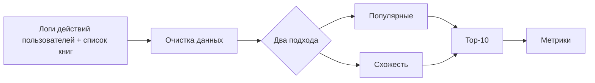
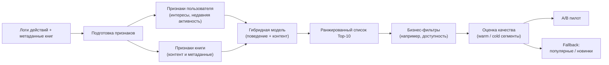

# ML System Design Doc
## Дизайн ML-системы: персональные рекомендации новинок в ленте BookRecs (Goodreads YA)

### 1. Цели и предпосылки 
#### 1.1. Зачем идем в разработку продукта?  

- **Бизнес-цель**  
  Сейчас пользователю сложно быстро найти «свою» книгу из большого каталога → он тратит время или уходит без покупки. Мы хотим упростить этот выбор с помощью рекомендаций. **Что это дает бизнесу:**

  - увеличиваем выручку и маржинальность за счёт более релевантных предложений;
  - повышаем конверсию (пользователь быстрее находит, что купить);
  - помогаем продавать не только бестселлеры, но и новинки + возможно получится продать книги, которые давно лежат на складе, как "непопулярные";
  

- **Почему использование ML улучшит текущее решение?**
  Проекты, которые используют рекомендации без ML, обычно используют подход (популярное / новинки) и имеют ряд минусов: одинаковые рекомендации для всех пользователей, не учитываются личные предпочтения, не находятся менее очевидные, но релевантные книги.

  **Что может дать ML:**

  - персонализация — рекомендации под конкретного пользователя;
  - лучшее попадание в интересы, что увеличивает вероятность покупки;
  - возможность находить менее очевидные, но релевантные книги;

- **Что считаем успехом итерации с точки зрения бизнеса**  
  Успех оцениваем через A/B тест: сравниваем новую систему рекомендаций с текущей и смотрим, меняется ли поведение пользователей. В первую очередь ожидаем, что пользователи начнут чаще покупать — это должно отражаться в росте выручки на сессию и среднего чека. Дополнительно смотрим на более простые сигналы: кликают ли пользователи на рекомендации, чаще ли с ними взаимодействуют и быстрее ли находят подходящую книгу.

  При этом важно, чтобы мы не ухудшили базовый опыт: конверсия в покупку не должна падать, возвраты — расти, а система — становиться заметно медленнее. Если пользователи активнее взаимодействуют с рекомендациями, чаще покупают, и при этом ключевые метрики остаются стабильными, считаем решение успешным.

#### 1.2. Бизнес-требования и ограничения  

- **Краткое описание БТ**

  Мы хотим показывать пользователям персональные рекомендации:
  - предлагать книги, которые могут им понравиться (на основе их интересов и поведения);
  - показывать «похожие книги» на странице конкретной книги;
  За счет этого увеличивать продажи 
 
- **Бизнес-ограничения**

  - Не стоит рекомендовать книги, которых нет в наличии;
  - Желательно объяснять пользователю, почему ему это показали (например: «похоже по жанру» или «из той же серии»); 
  
- **Что ожидаем от текущей итерации**

  - Делаем базовую версию (MVP) рекомендаций
  - Показываем их в нескольких местах: например, на главной, на странице книги и в корзине
  - Готовим дизайн A/B-пилота на части пользователей (контроль/тест, метрики, условия успеха)
  - Фиксируем офлайн-метрики и готовим критерии допуска модели в пилот
  - Готовим возможность быстро откатиться, если пилот пойдёт не так

- **Как проходит пилот?**

  - В онлайне (целевой формат):
 
    - показываем блок с рекомендациями
    - фиксируем, что пользователь его увидел
    - отслеживаем, кликает ли он и покупает ли что-то

  - В офлайне (целевой формат):
 
    - если можем понять, кто пользователь, добавляем его покупки в историю
    - потом используем это для рекомендаций онлайн
    - если не можем идентифицировать — просто не учитываем офлайн в MVP
     
- **Когда считаем пилот успешным**

  Пилот считаем успешным, если пользователи начинают больше покупать (например, растет выручка на сессию), а при этом *не падает конверсия, не растут возвраты и система работает стабильно*.

#### 1.3. Что входит в скоуп проекта/итерации, что не входит   

- **Что закрываем в текущей итерации**

  В этой итерации собираем рабочий MVP рекомендаций под задачу из `taskreadme.md`: персональные user2item рекомендации с устойчивостью к cold-start у книг.

  В рамках итерации:
  - делаем два простых ориентира: случайные/популярные рекомендации и базовую модель по похожему поведению пользователей;
  - делаем основную модель, которая сочетает поведение пользователей и данные о книгах, чтобы рекомендовать и новые книги тоже;
  - считаем обязательные метрики: `NDCG@10`, `Recall@10`, `Coverage@10` и отдельные cold-метрики (`ColdNDCG@10`, `ColdRecall@10`);
  - делаем валидацию отдельно для warm и cold книг, потому что в тесте они несбалансированы;
  - сохраняем обученные модели и артефакты запуска/инференса (метрики, конфиг, manifest; при необходимости — выгрузки рекомендаций);
  - готовим выдачу топ-N рекомендаций для блока в интерфейсе и запасной вариант: если модель недоступна, показываем популярные или новые книги.

- **Какие бизнес-требования закрывает текущая итерация**
  - появляется персонализация вместо одинаковой выдачи для всех;
  - новые книги не теряются в выдаче: модель умеет рекомендовать cold-start айтемы;
  - есть сравнение с бейзлайном по метрикам и таблица результатов;
  - подготовлены материалы для запуска A/B-пилота: контрольный и тестовый сценарии, список целевых и защитных метрик.

- **Что остается вне текущей итерации**
  - не оптимизируем «до идеала» latency и стоимость (делаем разумный MVP уровень);
  - не делаем explainability «как в зрелом продукте» (только базовые причины показа);
  - не закрываем cold-start пользователей (в тесте соревнования только warm пользователи);
  - не делаем полноценный онлайн-контур переобучения в реальном времени.

- **Требования к результату (качество кода и воспроизводимость)**
  - весь пайплайн воспроизводим: фиксируем `random seed`, версии библиотек и сплиты;
  - обучение, инференс и оценка разделены на отдельные шаги;
  - есть единая таблица метрик по всем подходам и отдельный срез по cold айтемам;
  - все ключевые гиперпараметры и конфиги вынесены в явный вид;
  - сохранение/загрузка моделей проверено, чтобы результаты можно было повторить без переобучения.
  
- **Требования соревнования Goodreads, которые учитываем** (датасет взят оттуда)
  - тестовый набор не изменяем;
  - делаем отдельную оценку для warm и cold книг;
  - показываем таблицу метрик для каждого подхода;
  - в таблице обязательно есть `NDCG@10`, `Recall@10`, `Coverage@10` и cold-метрика;
  - сохраняем веса обученных моделей;
  - итоговый MVP должен быть лучше случайного ориентира.

#### 1.4. Предпосылки решения  

- **Базовые предпосылки решения**
  - задача формулируется как персонализированный `top-N` ranking (а не прогноз рейтинга книги в абсолютных баллах);
  - целевой эффект для бизнеса — рост покупки через более релевантные рекомендации, поэтому оптимизируем ранжирование и покрытие каталога;
  - в данных много разреженности, а у части книг нет истории, поэтому чисто collaborative подход недостаточен — нужен гибрид.

- **Какие блоки данных используем**
  - в текущем MVP (Goodreads YA) используем `user_id x item_id` interactions с доступными полями `is_read`, `rating`, `date_added` и производными признаками;
  - событийные продуктовые логи уровня `impression -> click -> add_to_cart -> purchase` в текущем MVP/пилоте не используются и относятся к roadmap для следующих итераций (после появления продуктового логирования);
  - справочник книг: жанры, авторы, серия, описание, год, язык и прочие метаданные;
  - служебные признаки для фильтров: доступность/наличие, язык, базовые бизнес-ограничения.

- **Горизонт и частота пересчёта**
  - прогноз как таковой не строим, считаем релевантность «на ближайший показ» (next best books в текущем сеансе/визите);
  - переобучение MVP: батчево (например, раз в день/несколько дней), без realtime online-learning;
  - фичи пользователя пересчитываются с упором на recent историю, чтобы не терять актуальные интересы.

- **Гранулярность модели**
  - сущности уровня `user_id x item_id` (книга);
  - выдача в формате `top-N` (обычно `N=10`) на пользователя/контекст показа;
  - оценка качества отдельно по всему каталогу и отдельно по cold-item сегменту.

- **Предпосылки по данным и экспериментам**
  - тестовый набор фиксированный и не изменяется;
  - в тесте есть cold и warm книги, но пользователи warm, поэтому делаем акцент на item cold-start;
  - метрики считаем на одинаковом протоколе для всех моделей, чтобы сравнение было честным;
  - успех MVP формулируем относительно бейзлайна, а не «в вакууме».

- **Разделение учебного и продуктового контуров**
  - в рамках учебного/соревновательного контура используем фиксированный датасет Goodreads YA и считаем офлайн-метрики;
  - в рамках продуктового контура (пилот/production) целевым развитием являются `impression`-логи, A/B-инфраструктура, данные о наличии и технические метрики сервиса;
  - требования к пилоту и production в этом документе описаны как проектный дизайн, а не как фактически уже доступные данные соревнования.

- **Ограничения MVP, которые принимаем осознанно**
  - если часть пользовательских идентификаторов теряется между каналами, офлайн сигналы используем ограниченно;
  - объяснимость рекомендаций в MVP простая (по похожести/жанру), без сложного explanation engine;
  - при деградации модели используем fallback на популярное/новинки, чтобы не ломать пользовательский опыт.

### 2. Методология решения    

#### 2.1. Постановка задачи  

- С технической стороны делаем **персональную рекомендательную систему книг** (задача ранжирования), а не прогноз продаж и не поиск аномалий.
- Для каждого пользователя формируем список `top-10` книг, которые с наибольшей вероятностью заинтересуют его сейчас.
- Учитываем два режима:
  - **warm-книги**: у книги есть не меньше `k` взаимодействий до даты разделения (`k` фиксируем в эксперименте, например `k=5`); Warm/cold-статус книги определяется по числу взаимодействий в обучающем периоде (до даты split). Порог k фиксируется до запуска экспериментов и одинаков для всех моделей.
  - **cold-книги**: у книги меньше `k` взаимодействий до даты разделения (включая `0`).
- Основная цель модели: улучшить качество рекомендаций относительно простых ориентиров и не провалиться на cold-start книгах.
- Единица предсказания: пара `пользователь × книга`.
- Целевой сигнал для текущего MVP (Goodreads YA): взаимодействия `is_read`, `rating`, `date_added`; на их основе считаем вес взаимодействия для обучения.
- Для воспроизводимости заранее фиксируем схему веса взаимодействия, используемую в коде (текущая версия): `interaction_weight = 1.0 + 0.25 * rating + 0.5 * is_read` (с clipping/очисткой некорректных значений); протокол финальной офлайн-оценки (NDCG/Recall/Coverage) фиксируется отдельно и одинаков для всех моделей.

#### 2.2. Блок-схема решения  

- Ниже две схемы: отдельно для базового решения и для основного MVP.

**Базовое решение (ориентир):**

**Основной MVP (целевая схема):**

- В этой схеме уже есть гибридная модель, фильтры и подготовка к пилоту.

#### 2.3. Этапы решения задачи  

- Ниже план работ по этапам. Для каждого этапа отдельно фиксируем базовый вариант и MVP.

**Этап 1. Подготовка и проверка данных**

| Данные | Откуда берем | Нужны для | Проверки качества |
| --- | --- | --- | --- |
| История взаимодействий пользователя (Goodreads YA: `is_read`, `rating`, `date_added`) | датасет Goodreads YA | база + MVP (офлайн) | пропуски, дубли, корректность времени |
| Показ рекомендаций (если есть) | логи блока рекомендаций | будущий продуктовый пилот / A/B | полнота логов, корректность позиции |
| Справочник книг (жанр, автор, серия, описание) | каталог/метаданные / Goodreads YA | MVP (cold-start) | пустые поля, ошибки в категориях |
| Наличие книги (если есть) | склад/каталог | продуктовые фильтры / пилот | актуальность статуса «в наличии» |

- Базовый вариант:
  - чистим данные;
  - делаем простую матрицу взаимодействий `пользователь × книга`.
- MVP:
  - дополнительно готовим признаки книги и пользователя;
  - проверяем, что холодные книги не выпали из витрины.
- Выход этапа:
  - единая обучающая выборка;
  - отдельные срезы warm/cold для оценки.
- Риск:
  - мало сигналов по новым книгам.
- Как снижаем риск:
  - усиливаем метаданные и добавляем контентные признаки.

**Этап 2. Формирование выборок для обучения и проверки**

- Базовый вариант:
  - делим данные по времени (раньше -> обучение, позже -> проверка);
  - делаем негативные примеры из невыбранных книг (если есть `impression`-логи, сначала используем неперешедшие в клик показы как более честные негативы).
- MVP:
  - сохраняем тот же принцип по времени;
  - отдельно контролируем долю cold-книг в проверке.
- Выход этапа:
  - прозрачные и повторяемые выборки без утечки из будущего.
- Риск:
  - случайное смешивание по времени завысит качество.
- Как снижаем риск:
  - фиксируем временной разрез и запрещаем случайное перемешивание.

**Этап 3. Обучение базовых решений и MVP**

- Базовый вариант:
  - популярные/случайные рекомендации;
  - простая модель по похожему поведению пользователей.
- MVP:
  - гибридная модель: сигналы поведения + признаки книги;
  - настройка параметров на валидации.
- Выход этапа:
  - обученные модели и сохраненные артефакты запуска/оценки.
- Риск:
  - модель может хорошо работать на warm и слабо на cold.
- Как снижаем риск:
  - контролируем cold-метрики как обязательные, а не «дополнительные».

**Этап 4. Оценка качества и сравнение**

- Метрики:
  - NDCG@10 — качество ранжирования релевантных книг в top-10 с учетом позиции;
  - Recall@10 — доля релевантных тестовых книг пользователя, попавших в top-10;
  - Coverage@10 (global catalog coverage) — доля уникальных книг каталога, которые были рекомендованы хотя бы одному пользователю в top-10 на тесте;
  - ColdNDCG@10, ColdRecall@10 — те же метрики, но по релевантным cold-книгам (cold определяется по train-периоду);
  - дополнительно: long-tail share (доля рекомендаций из long-tail) для контроля перекоса в бестселлеры.
- Базовый вариант:
  - считаем метрики на общем наборе и фиксируем отправную точку.
- MVP:
  - считаем те же метрики + отдельно на cold сегменте;
  - сравниваем с базовым вариантом.
- Выход этапа:
  - единая таблица качества по всем подходам.
- Бизнес-проверка:
  - совместно с продуктом согласуем, что рост метрик достаточен для A/B пилота.

**Этап 5. Подготовка выдачи и бизнес-правил**

- Базовый вариант:
  - выдаем `top-10` без сложных доработок.
- MVP:
  - применяем фильтры: не показываем недоступные книги;
  - добавляем простой резервный сценарий (популярные/новинки), если модель недоступна.
- Выход этапа:
  - стабильная выдача для пилота без «пустых» ответов.
- Риск:
  - после фильтров список может стать слишком коротким.
- Как снижаем риск:
  - дополняем список резервными кандидатами.

**Этап 6. Подготовка к пилоту**

- Базовый вариант:
  - фиксируем контрольный сценарий (текущая выдача/популярные).
- MVP:
  - фиксируем тестовый сценарий;
  - сохраняем версию модели и параметры, чтобы результаты можно было повторить.
- Выход этапа:
  - готовый пакет для запуска пилота: модели, метрики, описание рисков и условий отката.
  
### 3. Подготовка пилота  

> Ниже описан целевой формат продуктового пилота. В рамках текущей итерации на датасете Goodreads YA пилот и событийное логирование уровня `impression/click/add_to_cart/purchase` не реализуются и рассматриваются как roadmap для следующего этапа.
  
#### 3.1. Способ оценки пилота  
  
- Пилот проводим как классический A/B тест на реальном трафике.
- Делим пользователей случайно на две группы:
  - **контроль**: текущая логика рекомендаций (или популярные книги, если текущей персонализации нет);
  - **тест**: новая модель рекомендаций из MVP.
- Пользователь всегда остается в своей группе на весь период пилота.
- Считаем эффект на уровне пользователя/сессии, а не по отдельным кликам, чтобы не завышать результат.
- Перед запуском фиксируем:
  - основную целевую метрику (рост покупок/выручки на сессию);
  - защитные метрики (конверсия в покупку, доля возвратов, задержка ответа, ошибки сервиса);
  - минимальную длительность теста и минимальный размер выборки;
  - статистический дизайн: `alpha`, `power`, `MDE`, правило остановки (для MVP — fixed horizon без досрочных остановок по промежуточным p-value);
  - окно атрибуции покупки к рекомендациям (например, в пределах той же сессии или фиксированного окна после клика).
- В ходе пилота каждый день проверяем корректность эксперимента:
  - равномерность разбиения групп;
  - отсутствие `SRM` (sample ratio mismatch);
  - целостность логов;
  - отсутствие критичных перекосов по сегментам.
- Итоговая оценка: сравниваем контроль и тест, смотрим статистическую значимость и практическую полезность эффекта.
  
#### 3.2. Что считаем успешным пилотом  
  
Пилот считаем успешным, если одновременно выполняются условия ниже:

- Основная метрика:
  - рост относительно контроля по **выручке на сессию** не ниже заранее зафиксированного `MDE` (например, `+2%` для пилота; точное значение фиксируется после оценки базового уровня и доступного трафика).
- Дополнительная бизнес-метрика:
  - доля сессий с покупкой (подтверждающий сигнал; не требуем значимого роста, но не допускаем статистически значимого ухудшения).
- Качество рекомендаций в продукте:
  - CTR блока рекомендаций не ухудшается (или растет);
  - не падает покрытие каталога/long-tail share ниже заранее заданного порога (чтобы не показывать только одни и те же книги).
- Защитные метрики:
  - конверсия в покупку не ухудшается статистически значимо;
  - доля возвратов не растет выше допустимого порога;
  - задержка ответа сервиса рекомендаций остается в допустимом коридоре (например, `p95 <= 200 мс`);
  - нет роста технических ошибок выше порога (например, error rate < `1%` и без деградации относительно контроля).
- Условия достоверности:
  - группы в A/B тесте сбалансированы;
  - длительности теста хватило, чтобы покрыть недельную сезонность;
  - эффект подтверждается статистически (`p < alpha`) и имеет практический смысл (не ниже целевого MDE).

Если основная метрика растет, а защитные метрики стабильны, принимаем решение о расширении пилота на больший трафик.
  
#### 3.3. Подготовка пилота  
  
- На этапе пилота выбираем вычислительно простой и устойчивый вариант, без «тяжелых» моделей.
- Что готовим до запуска:
  - стабильную версию модели и зафиксированные параметры;
  - выгрузку кандидатов/рекомендаций для тестовой группы;
  - резервный сценарий (популярные/новинки), если сервис модели недоступен;
  - для будущего продуктового пилота: логирование ключевых событий (показ, позиция, клик, корзина, покупка), версии модели и группы эксперимента.
- Ограничения по ресурсам в пилоте:
  - пересчет модели батчево (например, раз в сутки), без сложного онлайн-переобучения;
  - ограничиваем количество признаков и размер кандидатов, чтобы держать приемлемую задержку;
  - сначала запускаем на ограниченной доле трафика, затем расширяем при стабильных метриках.
- Как оцениваем вычислительную стоимость:
  - замеряем время обучения;
  - замеряем время подготовки рекомендаций;
  - замеряем задержку ответа в тестовой группе;
  - оцениваем объем хранения логов и артефактов моделей.
- План по шагам:
  - шаг 1: технический прогон на малом трафике и проверка логов;
  - шаг 2: запуск пилота на ограниченной аудитории;
  - шаг 3: промежуточный контроль метрик и качества данных;
  - шаг 4: финальный анализ и решение: масштабируем / дорабатываем / откатываем.

### 4. Внедрение в production (опционально)    

> Раздел 4 включается только если в рамках итерации планируется интеграция решения в production. Если текущая итерация ограничивается расчетом рекомендаций/артефактов для пилота, этот раздел можно не детализировать.  
  
#### 4.1. Архитектура решения   
  
- Для прод-варианта используем простую двухшаговую схему: сначала отбор кандидатов, потом их финальная сортировка.
- Основные блоки:
  - **Сервис рекомендаций**: принимает запрос от продукта и возвращает `top-N` книг.
  - **Хранилище признаков/витрина**: хранит подготовленные признаки пользователей и книг.
  - **Сервис кандидатов**: быстро собирает короткий список подходящих книг.
  - **Сервис ранжирования**: пересчитывает и упорядочивает кандидатов по релевантности.
  - **Логи и мониторинг**: пишут события показа/клика/покупки и технические метрики.
  - **Резервный сценарий**: если модель недоступна, отдаем популярные/новые книги.
- Поток запроса:
  - продукт -> сервис рекомендаций -> отбор кандидатов -> сортировка -> бизнес-фильтры -> ответ продукту.
  
#### 4.2. Описание инфраструктуры и масштабируемости 
  
- **Какая инфраструктура выбрана и почему**
  - отдельные задачи по расписанию для дообучения и подготовки признаков;
  - отдельное хранилище для логов событий и артефактов моделей.
- **Плюсы выбора**
  - легко масштабировать сервис рекомендаций при росте трафика;
  - можно независимо обновлять модель и онлайн-сервис;
  - проще контролировать стабильность и откаты.
- **Минусы выбора**
  - появляется больше компонентов и нужна дисциплина по мониторингу;
  - выше операционная сложность, чем у «одного скрипта».
- **Почему этот вариант лучше альтернатив**
  - для MVP и первых релизов это самый практичный баланс между скоростью внедрения, стоимостью и надежностью;
  - более сложные варианты (полностью онлайн обучение, очень тяжелые модели) сейчас дадут больше затрат, чем пользы.
  
#### 4.3. Требования к работе системы  
  
- Целевые требования на MVP/первый прод:
  - доступность сервиса рекомендаций: не ниже `99.5%`;
  - задержка ответа: `p95 <= 200 мс` для запроса рекомендаций;
  - целевая нагрузка: `100-500` запросов в секунду.
- Если метрики ухудшаются:
  - включаем резервный сценарий;
  - снижаем размер кандидатов/признаков;
  
#### 4.4. Безопасность системы  
  
- Потенциальные уязвимости:
  - перегрузка сервиса частыми запросами;
  - накрутка пользовательских событий ботами;
  - ошибки конфигурации при выкладке новой версии модели.
- Меры снижения риска:
  - ограничение частоты запросов и базовая защита от аномальной активности;
  - быстрый откат на последнюю стабильную версию.
  
#### 4.5. Безопасность данных   
  
- Работаем только с минимально необходимыми данными для рекомендаций.
- Основные меры:
  - не используем лишние персональные данные, которые не влияют на качество выдачи;
  - храним технические идентификаторы в обезличенном виде;
  - ограничиваем доступ к данным по ролям;
  - фиксируем сроки хранения логов и правила удаления устаревших данных.
- По комплаенсу:
  - соблюдаем локальные требования по персональным данным;
  - при работе с внешними данными проверяем лицензионные ограничения источников.
  
#### 4.6. Издержки  
  
- Основные статьи затрат в месяц:
  - вычисления для переобучения модели;
  - онлайн-инференс (обработка запросов рекомендаций);
  - хранение логов и артефактов моделей;
  - поддержка мониторинга и алертов.
- На этапе MVP ожидаем умеренные расходы, потому что:
  - обучение идет по расписанию, а не в реальном времени;
  - модель без избыточной сложности;
  - часть трафика может обслуживаться резервным сценарием.
- Подход к контролю затрат:
  - ежемесячно сверяем стоимость с приростом ключевых бизнес-метрик;
  - если эффект ниже ожиданий, упрощаем пайплайн или уменьшаем частоту пересчета.
  
#### 4.7. Точки интеграции  
  
- Основные точки интеграции:
  - фронт/бэкенд продукта -> сервис рекомендаций (получить `top-N`);
  - сервис рекомендаций -> хранилище признаков (получить признаки пользователя и книги);
  - сервис рекомендаций -> каталог/склад (проверить доступность книги);
  - сервис рекомендаций -> система логирования (события показа и клика);
  - сервис рекомендаций -> A/B система (получить группу пользователя).
- Формат взаимодействия:
  - синхронный запрос для выдачи рекомендаций;
  - асинхронная отправка событий в логи.
  
#### 4.8. Риски  
  
- Ключевые риски:
  - деградация качества после релиза из-за изменения поведения пользователей;
  - перекос в сторону популярных книг и падение разнообразия;
  - плохое качество логов и невозможность честно оценить эффект A/B;
  - рост задержки при увеличении трафика;
  - технический долг из-за быстрых MVP-решений.
- План снижения рисков:
  - постоянный мониторинг бизнес- и технических метрик;
  - регулярная перепроверка качества на warm/cold сегментах;
  - автоматические алерты на пропуски логов и скачки задержки;
  - регламент быстрого отката и обновления модели по расписанию.
