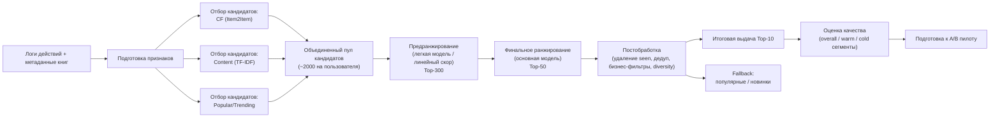
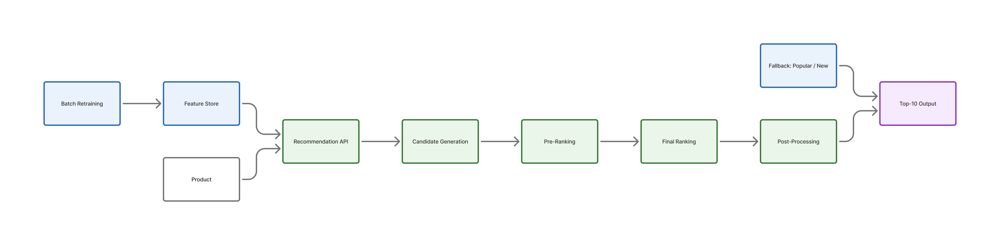

# ML System Design Doc
## Дизайн ML-системы: персональные рекомендации новинок в ленте BookRecs (Goodreads YA)

### 1. Цели и предпосылки 
#### 1.1. Зачем идем в разработку продукта?  

- **Бизнес-цель**  
  Сейчас пользователю сложно быстро найти «свою» книгу из большого каталога → он тратит время или уходит без покупки. Мы хотим упростить этот выбор с помощью рекомендаций. **Что это дает бизнесу:**

  - увеличиваем выручку за счёт более релевантных предложений;
  - повышаем конверсию (пользователь быстрее находит, что купить);
  - помогаем продавать не только бестселлеры, но и новинки + возможно получится продать книги, которые давно лежат на складе, как "непопулярные";
  

- **Почему использование ML улучшит текущее решение?**
  Проекты, которые используют рекомендации без ML, обычно используют подход (популярное / новинки) и имеют ряд минусов: одинаковые рекомендации для всех пользователей, не учитываются личные предпочтения, не находятся менее очевидные, но релевантные книги.

  **Что может дать ML:**

  - персонализация — рекомендации под конкретного пользователя;
  - лучшее попадание в интересы, что увеличивает вероятность покупки;
  - возможность находить менее очевидные, но релевантные книги;

- **Что считаем успехом итерации с точки зрения бизнеса**  
  Успех оцениваем через A/B тест: сравниваем новую систему рекомендаций с текущей и смотрим, меняется ли поведение пользователей. В первую очередь ожидаем, что пользователи начнут чаще покупать — это должно отражаться в росте выручки на сессию и среднего чека. Дополнительно смотрим на более простые сигналы: кликают ли пользователи на рекомендации, чаще ли с ними взаимодействуют и быстрее ли находят подходящую книгу.

  При этом важно, чтобы мы не ухудшили базовый опыт: конверсия в покупку не должна падать, возвраты — расти, а система — становиться заметно медленнее. Если пользователи активнее взаимодействуют с рекомендациями, чаще покупают, и при этом ключевые метрики остаются стабильными, считаем решение успешным.

#### 1.2. Бизнес-требования и ограничения  

- **Краткое описание БТ**

  Мы хотим показывать пользователям персональные рекомендации:
  - предлагать книги, которые могут им понравиться (на основе их интересов и поведения);
  - показывать «похожие книги» на странице конкретной книги;
  За счет этого увеличивать продажи 
 
- **Бизнес-ограничения**

  - Не стоит рекомендовать книги, которых нет в наличии;
  - Желательно объяснять пользователю, почему ему это показали (например: «похоже по жанру» или «из той же серии»); 
  
- **Что ожидаем от текущей итерации**

  - Делаем базовую версию (MVP) рекомендаций
  - Показываем их в нескольких местах: например, на главной, на странице книги и в корзине
  - До запуска пилота проводим offline-оценку как технический этап допуска
  - Проверяем MVP в формате ограниченного продуктового пилота `online A/B` (`control vs test`)
  - Фиксируем продуктовые метрики, guardrail-метрики и условия успеха пилота
  - Готовим возможность быстро откатиться, если пилот пойдёт не так

- **Как проходит пилот?**

  - До пилота: `offline replay`
    - используем как pre-check перед выходом в продукт;
    - сравниваем baseline и MVP по фиксированному holdout-набору;
    - проверяем, что модель проходит пороги качества и не проваливается на cold-сегменте.

  - Пилот текущей итерации: ограниченный `online A/B`
    - показываем блок с рекомендациями в реальном трафике на одном фиксированном placement;
    - контроль: действующий baseline;
    - тест: трехступенчатый MVP;
    - фиксируем показы, клики, add-to-cart и покупки;
    - считаем эффект на уровне пользователя/сессии.
     
- **Когда считаем пилот успешным**

  - До запуска пилота (`offline replay`): модель допускается в продуктовый пилот, если выполняются пороги по `NDCG@10`, `Recall@10`, `ColdNDCG@10`, `ColdRecall@10` и нет критичной деградации warm-среза.
  - Для пилота (`online A/B`): пилот успешен, если растет выручка по `cold`-книгам из рекомендательного блока, при этом не ухудшаются выручка на сессию, доля сессий с покупкой, средний чек и стабильность сервиса.

- **Бизнес-метрики текущей итерации (простыми словами)**

  - **Выручка по cold-книгам из рекомендательного блока**  
    Что показывает: сколько денег приносят покупки `cold`-книг, пришедшие из рекомендаций.  
    Зачем нужна: это главная целевая метрика текущего пилота, потому что она напрямую связывает cold-start сценарий с бизнес-эффектом.

  - **Продажи cold-книг / доля заказов с cold-книгой из рекомендательного блока**  
    Что показывает: насколько чаще покупают `cold`-книги и в какой доле заказов они вообще появляются благодаря рекомендациям.  
    Зачем нужна: это вторичная продуктовая метрика, которая помогает интерпретировать, за счет чего меняется выручка по cold-сегменту.

  - **Выручка на сессию**  
    Что показывает: сколько денег в среднем приносит один визит.  
    Зачем нужна: guardrail для проверки, что рост выручки по cold-книгам не достигается ценой просадки общей выручки.

  - **Конверсия в покупку**  
    Что показывает: какая доля визитов заканчивается покупкой.  
    Зачем нужна: помогает понять, действительно ли рекомендации приводят к покупке, а не только к просмотрам.

  - **Средний чек**  
    Что показывает: на какую сумму в среднем оформляют заказ.  
    Зачем нужна: видно, помогают ли рекомендации покупать больше или более дорогие книги.

  - **Доля заказов с рекомендованной книгой**  
    Что показывает: в какой части заказов есть хотя бы одна книга из блока рекомендаций.  
    Зачем нужна: показывает прямой вклад рекомендаций в продажи.

  - **Клики по блоку рекомендаций**  
    Что показывает: как часто пользователи открывают рекомендованные книги.  
    Зачем нужна: ранний сигнал полезности; если кликов нет, дальше покупок тоже обычно мало.

#### 1.3. Что входит в скоуп проекта/итерации, что не входит   

- **Что закрываем в текущей итерации**

  В этой итерации собираем рабочий MVP рекомендаций для книжного интернет-магазина: персональные user2item рекомендации с устойчивостью к cold-start у книг.

  В рамках итерации:
  - реализуем трехступенчатую рекомендательную систему: отбор кандидатов -> предранжирование -> финальное ранжирование + постобработка;
  - используем несколько источников кандидатов (`Item2Item`, `Content TF-IDF`, `Popular/Trending`), чтобы не терять cold-книги;
  - на этапе предранжирования сокращаем пул кандидатов до управляемого размера, на финальном ранжировании формируем точный `top-N`;
  - считаем обязательные метрики: `NDCG@10`, `Recall@10`, `Coverage@10` и отдельные cold-метрики (`ColdNDCG@10`, `ColdRecall@10`);
  - делаем валидацию отдельно для warm и cold книг, чтобы не маскировать ошибки на cold-сегменте;
  - сохраняем обученные модели и артефакты запуска/инференса (метрики, конфиг, manifest; при необходимости — выгрузки рекомендаций);
  - готовим выдачу top-N рекомендаций для блока в интерфейсе и запасной вариант: если модель недоступна, показываем популярные или новые книги.

- **Какие бизнес-требования закрывает текущая итерация**
  - появляется персонализация вместо одинаковой выдачи для всех;
  - новые книги не теряются в выдаче: модель умеет рекомендовать cold-start айтемы;
  - есть сравнение с бейзлайном по метрикам и таблица результатов;
  - подготовлены материалы для запуска A/B-пилота: контрольный и тестовый сценарии, список целевых и защитных метрик.

- **Что остается вне текущей итерации**
  - не оптимизируем «до идеала» latency и стоимость (делаем разумный MVP уровень);
  - не делаем explainability «как в зрелом продукте» (только базовые причины показа);
  - не закрываем cold-start пользователей (в тесте соревнования только warm пользователи);
  - не делаем полноценный онлайн-контур переобучения в реальном времени;
  - не добавляем cold-start юзеров.

- **Требования к результату (качество кода и воспроизводимость)**
  - весь пайплайн воспроизводим: фиксируем `random seed`, версии библиотек и сплиты;
  - обучение, инференс и оценка разделены на отдельные шаги;
  - есть единая таблица метрик по всем подходам и отдельный срез по cold айтемам;
  - все ключевые гиперпараметры и конфиги вынесены в явный вид;
  - сохранение/загрузка моделей, чтобы результаты можно было повторить без переобучения.

#### 1.4. Предпосылки решения  

- **Базовые предпосылки решения**
  - задача формулируется как персонализированный `top-N` ranking (а не прогноз рейтинга книги в абсолютных баллах);
  - целевой эффект для бизнеса — рост покупки через более релевантные рекомендации, поэтому оптимизируем ранжирование и покрытие каталога;
  - в данных много разреженности, а у части книг нет истории, поэтому чисто collaborative подход недостаточен — нужен гибрид.

- **Какие блоки данных используем**
  - в текущем MVP (Goodreads YA) используем `user_id x item_id` interactions с доступными полями `is_read`, `rating`, `date_added` и производными признаками;
  - для продуктового пилота используем событийные логи уровня `impression -> click -> add_to_cart -> purchase` как основу онлайн-оценки эффекта;
  - справочник книг: жанры, авторы, серия, описание, год, язык и прочие метаданные;
  - служебные признаки для фильтров: доступность/наличие, язык, базовые бизнес-ограничения.

- **Горизонт и частота пересчёта**
  - прогноз как таковой не строим, считаем релевантность «на ближайший показ» (next best books в текущем сеансе/визите);
  - переобучение MVP: батчево (например, раз в день/несколько дней), без realtime online-learning;
  - фичи пользователя пересчитываются с упором на recent историю, чтобы не терять актуальные интересы.

- **Гранулярность модели**
  - сущности уровня `user_id x item_id` (книга);
  - выдача в формате `top-N` (обычно `N=10`) на пользователя/контекст показа;
  - оценка качества отдельно по всему каталогу и отдельно по cold-item сегменту.

- **Предпосылки по данным и экспериментам**
  - тестовый набор фиксированный и не изменяется;
  - в тесте есть cold и warm книги, но пользователи warm, поэтому делаем акцент на item cold-start;
  - метрики считаем на одинаковом протоколе для всех моделей, чтобы сравнение было честным;
  - успех MVP формулируем относительно бейзлайна, а не «в вакууме».

- **Разделение продуктового и research контуров**
  - в рамках контура тестирования (research) используем фиксированный датасет Goodreads YA и считаем офлайн-метрики;
  - в рамках продуктового контура (пилот/production) используем `impression`-логи, A/B-инфраструктуру, данные о наличии и технические метрики сервиса;
  - требования к пилоту и production в этом документе описаны как проектный дизайн.

- **Ограничения MVP, которые принимаем осознанно**
  - если в части событий нет стабильного user_id (или он меняется), такие события не используем для обучения персональной модели; в MVP обучаемся только на надёжно идентифицируемых взаимодействиях;
  - в MVP реализуем базовую объяснимость рекомендаций (например, по жанру, автору или похожим книгам) без отдельного сложного explanation-сервиса;
  - при недоступности или деградации модели автоматически переключаемся на fallback-выдачу (популярное/новинки), чтобы сохранить стабильный пользовательский опыт.

### 2. Методология решения    

#### 2.1. Постановка задачи  

- С технической стороны делаем **персональную рекомендательную систему книг** (задача ранжирования), а не прогноз продаж и не поиск аномалий.
- Для каждого пользователя формируем список `top-10` книг, которые с наибольшей вероятностью заинтересуют его сейчас.
- Учитываем два режима:
  - **warm-книги**: у книги есть не меньше `k` взаимодействий до даты разделения (`k` фиксируем в эксперименте, например `k=5`); Warm/cold-статус книги определяется по числу взаимодействий в обучающем периоде (до даты split). Порог k фиксируется до запуска экспериментов и одинаков для всех моделей.
  - **cold-книги**: у книги меньше `k` взаимодействий до даты разделения (включая `0`).
- Основная цель модели: улучшить качество рекомендаций относительно простых ориентиров и не провалиться на cold-start книгах.
- Единица предсказания: пара `пользователь × книга`.
- Целевой сигнал для текущего MVP (Goodreads YA): взаимодействия `is_read`, `rating`, `date_added`; на их основе считаем вес взаимодействия для обучения.
- Для воспроизводимости заранее фиксируем схему веса взаимодействия, используемую в коде (текущая версия): `interaction_weight = 1.0 + 0.25 * rating + 0.5 * is_read` (с clipping/очисткой некорректных значений); протокол финальной офлайн-оценки (NDCG/Recall/Coverage) фиксируется отдельно и одинаков для всех моделей.

#### 2.2. Блок-схема решения  

- Ниже целевая схема MVP.

- В этой схеме используем трехступенчатую рекомендательную архитектуру:
  1) отбор кандидатов,
  2) предранжирование,
  3) финальное ранжирование + постобработка.

```mermaid
flowchart LR
A["Логи действий + метаданные книг"] --> B["Подготовка признаков"]

B --> C1["Отбор кандидатов:<br/>CF (Item2Item)"]
B --> C2["Отбор кандидатов:<br/>Content (TF-IDF)"]
B --> C3["Отбор кандидатов:<br/>Popular/Trending"]

C1 --> D["Объединенный пул кандидатов<br/>(~2000 на пользователя)"]
C2 --> D
C3 --> D

D --> E["Предранжирование<br/>(легкая модель / линейный скор)<br/>Top-300"]

E --> F["Финальное ранжирование<br/>(основная модель)<br/>Top-50"]

F --> G["Постобработка<br/>(удаление seen, дедуп, бизнес-фильтры, diversity)"]

G --> H["Итоговая выдача Top-10"]
G --> I["Fallback:<br/>популярные / новинки"]

H --> J["Оценка качества<br/>(overall / warm / cold сегменты)"]
J --> K["Подготовка к A/B пилоту"]
```

#### 2.3. Этапы решения задачи  

- Ниже план работ по этапам для MVP.

**Этап 1. Подготовка данных и проверка качества**

| Данные | Откуда берем | Нужны для | Проверки качества |
| --- | --- | --- | --- |
| История взаимодействий пользователя (Goodreads YA: `is_read`, `rating`, `date_added`) | датасет Goodreads YA | обучение и офлайн-оценка | пропуски, дубли, корректность времени, валидность `rating` |
| Метаданные книг (жанр, автор, серия, описание, язык, год) | Goodreads YA metadata / каталог книги | контентные признаки и cold-item сценарий | заполненность полей, нормализация категорий, шум |
| Служебные признаки (`is_cold_item`, границы train/valid/test) | формируем в preprocessing | честная сегментная оценка | отсутствие leakage, стабильность порога `k`, воспроизводимость split |

- Готовим признаки пользователя и книги.
- Контролируем, что cold-книги не теряются на этапе подготовки.

**Этап 2. Ступень 1 — отбор кандидатов (candidate generation)**

- Собираем кандидатов из нескольких источников:
  - `Item2Item CF`,
  - `Content TF-IDF`,
  - `Popular/Trending`,
  - при необходимости — кандидаты по авторам/сериям/тегам.
- Объединяем источники в единый пул `~1500–3000` кандидатов на пользователя.
- Выход этапа:
  - `candidate_table` с `user_id`, `item_id`, `source`, `raw_score`.
- Риск:
  - слабый охват cold-книг.
- Как снижаем риск:
  - выделяем отдельный cold-aware источник кандидатов (content).

**Этап 3. Ступень 2 — предранжирование (pre-ranking)**

- Цель:
  - быстро отсеять шум и сократить пул кандидатов до `~200–300`.
- Легкая модель (например, логистическая регрессия/линейный скор) по признакам:
  - `score_cf`, `score_content`, `score_pop`,
  - `history_len`, `is_cold_item`, `source`.
- Выход этапа:
  - сокращенный список кандидатов для финального ранжирования.

**Этап 4. Ступень 3 — финальное ранжирование (final ranking)**

- Основная модель ранжирования на сокращенном пуле.
- Используем признаки поведения + контента + популярности.
- Приоритет: максимальная точность в `top-10`.
- Выход этапа:
  - финальный score кандидатов перед выдачей.
- Риск:
  - улучшение warm-качества ценой провала на cold.
- Как снижаем риск:
  - отдельно контролируем cold-метрики и вводим cold-item защиту в ранжировании.

**Этап 5. Постобработка и формирование выдачи**

- Удаляем уже просмотренные книги.
- Применяем бизнес-фильтры (например, наличие).
- Делаем дедуп и ограничение однотипных книг.
- Формируем итоговый `top-10`.
- Если основной контур недоступен, включаем fallback (`популярные/новинки`).

**Этап 6. Оценка качества и подготовка к пилоту**

- Метрики:
  - `NDCG@10`, `Recall@10`, `Coverage@10`;
  - `ColdNDCG@10`, `ColdRecall@10`;
  - срезы: `overall / warm / cold`.
- Оцениваем трехступенчатый MVP на фиксированном протоколе как этап допуска в продуктовый пилот.
- Прирост по cold-метрикам — обязательное условие качества.
- Выход этапа:
  - единая таблица результатов;
  - зафиксированный пакет артефактов для пилота (модели, конфиги, отчеты, условия раскатки и отката).
  
### 3. Подготовка пилота  

> В этом разделе описываем, как рекомендательная система проходит пилотную проверку перед запуском в продуктовый контур: как сравниваем baseline и трехступенчатый MVP, по каким критериям принимаем решение `go / no-go` и какие артефакты должны быть зафиксированы до старта.
>
> В текущей итерации офлайн-оценка используется только как этап допуска, а сам пилот проводится в формате ограниченного `online A/B` на реальном трафике. Это позволяет оценивать не только качество ранжирования, но и реальные продуктовые метрики.
  
#### 3.1. Способ оценки пилота  

**Что сравниваем**
- В этой итерации сравниваем именно два контура рекомендаций на одном и том же протоколе:
  - **Control**: действующий baseline;
  - **Test**: трехступенчатый MVP-контур из пункта 2:
    - ступень 1: отбор кандидатов (`Item2Item + Content + Popular/Trending`);
    - ступень 2: предранжирование;
    - ступень 3: финальное ранжирование + постобработка и выдача `top-10`.

**Как проходит допуск до пилота**
- перед выходом в продукт выполняем `offline replay` на holdout-наборе, который обновляется по расписанию;
- holdout ежедневно дополняется новыми пользовательскими взаимодействиями с книгами, чтобы офлайн-оценка не отрывалась от текущего состояния продукта;
- внутри одного конкретного прогона сравнения используем один и тот же снапшот holdout, один и тот же протокол метрик и одинаковые правила оценки для `Control` и `Test`;
- единица сравнения на этом шаге: итоговая персональная выдача `top-10` для пользователя;
- обязательные срезы качества: `overall`, `warm`, `cold`.

**Как проходит текущий пилот**
- запускаем ограниченный `online A/B` на реальном трафике и одном фиксированном placement;
- рандомизация выполняется по `user_id`, пользователь закрепляется за одной группой на весь период теста;
- в `Control` пользователь видит текущую выдачу, в `Test` — новый трехступенчатый MVP;
- фиксируем показы, клики, add-to-cart, покупки, а также технические метрики сервиса;
- единица сравнения: пользователь или сессия, закрепленная за одной группой на весь период теста.

**Дополнительный сценарий: как сейчас**
- если полный продуктовый пилот недоступен из-за ограничений текущего контура, используем двухшаговый сценарий;
- сначала проводим `offline replay` как обязательный этап допуска;
- затем запускаем ограниченный `online A/B` только на одном placement и на небольшой доле трафика;
- в этом сценарии основной фокус остается на выручке по `cold`-книгам, а общие продуктовые метрики и технические показатели выступают guardrail-проверками.

**Цель текущего пилота**
- проверить, что новый трехступенчатый контур дает продуктовый эффект относительно baseline в реальных условиях показа;
- отдельно убедиться, что потенциальный uplift не достигается ценой деградации конверсии, среднего чека или стабильности сервиса;
- проверить, что контур технически устойчив и может безопасно работать на ограниченной доле трафика.

**Операционные проверки**
- размер объединенного пула после отбора кандидатов;
- размер пула после предранжирования;
- долю пустых выдач после финального ранжирования и постобработки;
- время расчета по ступеням и суммарно;
- факт срабатывания fallback и долю запросов, где он понадобился.

**Дизайн `online A/B`**
- рандомизация выполняется по `user_id`, чтобы один и тот же пользователь не видел попеременно две разные логики рекомендаций;
- пользователь закрепляется за одной группой на весь период эксперимента;
- на первом этапе тест запускаем на одном фиксированном placement, чтобы эффект было проще интерпретировать;
- в логах фиксируем как минимум `user_id`, `session_id`, `experiment_id`, группу (`control/test`), placement, `model_version`, показы, клики и покупки;
- основной продуктовой метрикой считаем выручку по `cold`-книгам из рекомендательного блока;
- дополнительными продуктовыми метриками считаем продажи `cold`-книг, долю заказов с `cold`-книгой из рекомендаций, выручку на сессию, долю сессий с покупкой, долю заказов с рекомендованной книгой и CTR блока рекомендаций;
- guardrail-метрики online-этапа: latency, error rate, доля пустых выдач и доля fallback.

**Почему выбираем `A/B`**
- рекомендации влияют не только на офлайн-качество ранжирования, но и на реальное поведение пользователя;
- только `A/B` позволяет причинно оценить эффект новой логики на клики, покупки и выручку по сравнению с текущей системой;
- такой формат лучше всего соответствует задаче сравнения `baseline` и нового рекомендательного контура в реальном продуктовом сценарии.

**Какие альтернативы рассматривались**
- `shadow mode`: полезен как техническая проверка логирования, стабильности и корректности интеграции, но не позволяет измерить реальный пользовательский эффект, потому что не меняет фактическую выдачу;
- `interleaving`: подходит для быстрого сравнения двух ранжирующих систем по кликам, но хуже подходит для нашего кейса, где важны не только клики, но и downstream-метрики покупки и выручки.
  
#### 3.2. Что считаем успешным пилотом  

Пилот текущей итерации считаем успешным, если одновременно выполняются следующие условия.

1. **Offline entry criteria до запуска пилота**
- `Test` лучше `Control` по `NDCG@10` и `Recall@10` на общем holdout-наборе.
- Улучшение считается валидным только если оно получено на одном и том же протоколе оценки, одинаковом для всех сравниваемых подходов.
- Для каждого цикла оценки используем актуальный снапшот holdout, собранный с учетом новых пользовательских взаимодействий за предыдущие сутки.
- Отдельно фиксируем итоговую таблицу метрик по `overall`, `warm`, `cold`.

2. **Обязательные offline-критерии по cold-item сегменту**
- По cold-книгам должен быть рост `ColdNDCG@10` и `ColdRecall@10` относительно baseline.
- Отсутствие прироста по cold-сегменту считаем стоп-фактором, даже если общий `overall` улучшился.
- По warm-сегменту не допускаем критичной деградации качества относительно baseline.

3. **Основные продуктовые критерии пилота**
- `Test` лучше `Control` по выручке по `cold`-книгам из рекомендательного блока.
- `Test` лучше `Control` по продажам `cold`-книг и/или по доле заказов с `cold`-книгой из рекомендаций.
- Выручка на сессию не ухудшается относительно baseline.
- Доля сессий с покупкой не ухудшается относительно baseline.
- Средний чек не показывает статистически и бизнес-значимой деградации.
- CTR блока рекомендаций используем как ранний supporting signal, но не как единственный критерий успеха.

4. **Guardrail- и технические критерии пилота**
- Latency, error rate, доля пустых выдач и доля fallback остаются в заранее зафиксированных пределах.
- Все три ступени контура отрабатывают воспроизводимо на фиксированном конфиге.
- Размер пула после candidate generation и после pre-ranking остается в заранее зафиксированных границах.
- Fallback работает корректно и может быть включен без нарушения пользовательского сценария.

5. **Правило принятия решения**
- Решение `go` принимаем, если `Test` прошел offline-допуск, показал положительный продуктовый эффект и не нарушил guardrail-метрики.
- Решение `revise` принимаем, если есть локальные улучшения, но провален хотя бы один обязательный продуктовый или технический критерий.
- Решение `no-go` принимаем, если новая система не показывает бизнес-эффект относительно baseline, ухудшает ключевые продуктовые метрики или нарушает стабильность сервиса.

- После статуса `go` пилот можно расширять на больший процент трафика и на дополнительные placement-ы.
  
#### 3.3. Подготовка пилота  

- До запуска ограниченного `online A/B` фиксируем полный контракт пилота.

1. **Артефакты и версии**
- версию baseline и версию трехступенчатого MVP-контура;
- источники кандидатов, параметры их объединения и правила post-processing;
- артефакты pre-ranking и final ranking моделей;
- конфиг расчета офлайн-метрик, manifest запуска и версию онлайн-конфигурации эксперимента.

2. **Параметры трех ступеней**
- целевой размер пула после candidate generation;
- целевой размер пула после pre-ranking;
- правила удаления `seen`-объектов, дедупликации, бизнес-фильтров и fallback;
- все параметры, влияющие на финальный `top-10`, фиксируются до старта сравнения и не меняются в ходе проверки.

3. **Протокол оценки**
- holdout-набор обновляется ежедневно и пополняется новыми пользовательскими взаимодействиями с книгами;
- для каждого запуска offline-допуска фиксируем отдельный снапшот holdout, общий для `Control` и `Test`;
- единый набор offline-метрик: `NDCG@10`, `Recall@10`, `Coverage@10`, `ColdNDCG@10`, `ColdRecall@10`;
- единые срезы offline-оценки: `overall`, `warm`, `cold`;
- при обновлении holdout соблюдаем временную границу между train и оценкой, чтобы новые interactions попадали только в оценочный контур и не создавали leakage;
- для online-пилота фиксируем продуктовые метрики, guardrail-метрики, единицу рандомизации, размер трафика, длительность теста и шаблон итогового отчета.

4. **Техническая готовность к проверке**
- выполняем dry-run полного контура на зафиксированном конфиге;
- проверяем корректность всех трех ступеней и отсутствие критичных пустых выдач;
- проверяем сохранение и загрузку артефактов без повторного обучения;
- проверяем корректность логирования `impression/click/add_to_cart/purchase` и то, что fallback (`популярные/новинки`) включается корректно.

5. **План отката и следующий шаг**
- если offline replay не проходит обязательные критерии, новой системе не даем допуск в продуктовый пилот и возвращаемся к доработке candidate generation, pre-ranking или final ranking;
- если online A/B не проходит продуктовые или guardrail-критерии, останавливаем эксперимент, откатываемся на baseline и дорабатываем контур;
- если пилот проходит критерии, фиксируем статус `go`, пакет артефактов и переходим к расширению трафика или новых placement-ов.

### 4. Продуктивизация  
 
#### 4.1. Архитектура решения   
  
- Для production-варианта используем тот же трехступенчатый контур, который описан в пункте 2: `candidate generation -> pre-ranking -> final ranking -> post-processing`.

**Основные компоненты**
- **API сервиса рекомендаций**: принимает запрос от продукта и возвращает итоговый `top-N`.
- **Feature store / витрина признаков**: хранит подготовленные пользовательские и item-признаки для online-инференса.
- **Сервис candidate generation**: быстро собирает объединенный пул кандидатов из `Item2Item`, `Content` и `Popular/Trending`.
- **Сервис pre-ranking**: сокращает пул кандидатов до управляемого размера.
- **Сервис final ranking**: пересчитывает итоговый релевантностный score на сокращенном пуле.
- **Сервис post-processing**: удаляет `seen`, применяет бизнес-фильтры, дедупликацию и правила diversity.
- **Контур fallback**: возвращает популярные/новые книги, если основной ML-маршрут недоступен или деградировал.
- **Контур логирования и мониторинга**: пишет продуктовые события (`impression/click/purchase`) и технические метрики.
- **Batch-контур обучения**: отвечает за пересчет признаков, переобучение моделей и публикацию новых артефактов.

**Нормальный поток online-запроса**
- продукт отправляет запрос на получение рекомендаций;
- API сервиса определяет placement, пользователя и экспериментальную группу;
- из feature store подгружаются нужные признаки пользователя и книги;
- candidate generation формирует пул кандидатов;
- pre-ranking сокращает пул до заданного размера;
- final ranking упорядочивает кандидатов по релевантности;
- post-processing применяет фильтры и формирует итоговый `top-N`;
- сервис возвращает выдачу в продукт и асинхронно пишет события показа.

**Контур batch-пересчета**
- по расписанию пересчитываем признаки, обновляем витрины и переобучаем модели;
- новые артефакты публикуются только после валидации и регистрации версии;
- online-сервис использует только последнюю стабильную опубликованную версию.

**Отказоустойчивость и режимы деградации**
- если недоступен final ranking или превышен latency-бюджет, система переключается на упрощенный маршрут или fallback;
- если недоступна часть признаков, сервис использует упрощенный набор фич или более легкий ranking-маршрут;
- если одна из ступеней возвращает критично мало кандидатов, включается резервное добавление популярных/новых книг;
- если ошибка модели или деградация держится дольше допустимого окна, выполняется rollback на предыдущую стабильную версию артефакта;
- при полном отказе ML-контура продукт должен получать непустую безопасную выдачу через fallback, а не ошибку пользователю.

  
#### 4.2. Описание инфраструктуры и масштабируемости 
  
- **Предпочтительный production-вариант**
  - контейнеризация всех компонентов;
  - оркестрация online-сервисов в `Kubernetes`;
  - batch-задачи по пересчету признаков и обучению запускаются отдельно по расписанию;
  - хранилище артефактов моделей, отдельное хранилище продуктовых логов и отдельная витрина признаков.

- **Почему выбираем `Kubernetes`**
  - можно независимо масштабировать API, candidate generation, ranking и вспомогательные сервисы;
  - проще настраивать readiness/liveness checks, автоперезапуск и self-healing;
  - удобно проводить rollout и rollback новых версий сервисов и моделей;
  - проще поддерживать несколько окружений: `dev`, `staging`, `prod`.

- **Разделение контуров**
  - **online-контур** обслуживает продуктовые запросы и должен укладываться в жесткий latency-бюджет;
  - **batch-контур** пересчитывает признаки, переобучает модели и публикует новые версии без влияния на latency online-сервиса;
  - тяжелые асинхронные операции не должны блокировать пользовательский запрос.

- **Масштабирование**
  - API и inference-компоненты масштабируются горизонтально по нагрузке;
  - feature store и логирование масштабируются отдельно от ranking-контура;
  - при росте трафика можно отдельно увеличивать ресурсы для candidate generation или final ranking, не затрагивая остальные части системы.

- **Раскатка**
  - новая версия модели сначала публикуется как отдельный версионированный артефакт;
  - релизы сервисов выполняем через `rolling update`, `blue/green` или `canary`;
  - откат должен сводиться к переключению на предыдущую стабильную версию сервиса и/или модели.
  
#### 4.3. Требования к работе системы  
  
- **SLO / SLA для первого production-этапа**
  - доступность сервиса рекомендаций: не ниже `99.5%` за календарный месяц;
  - задержка ответа: `p95 <= 200 мс` для end-to-end запроса рекомендаций;
  - error rate: `< 1%` в рабочие часы;
  - целевая нагрузка: `100-500` запросов в секунду на online-контур;
  - доля пустых выдач после post-processing: не выше заранее зафиксированного порога.

- **Операционные требования**
  - сервис должен возвращать непустой ответ даже при деградации основного ML-контура;
  - публикация новой версии модели не должна прерывать обработку online-запросов;
  - feature freshness и пересчет витрин должны соответствовать выбранной batch-частоте.

- **Триггеры деградации**
  - если `p95 > 200 мс` в нескольких окнах подряд, включаем упрощенный маршрут или fallback;
  - если `error rate >= 1%` держится более заданного окна, выводим новый артефакт из трафика;
  - если доля пустых выдач или срабатываний fallback резко растет, инициируем разбор инцидента.

- **Rollback / incident response**
  - если деградация сохраняется более 30 минут, откатываемся на предыдущую стабильную версию модели;
  - если проблема вызвана сервисным релизом, откатываем deployment на предыдущий образ;
  - для инцидентов фиксируем целевой `RTO <= 30 минут` и `RPO <= 5 минут` для продуктовых событий и логов.
  
#### 4.4. Безопасность системы  
  
- **Основные угрозы**
  - перегрузка сервиса частыми запросами;
  - ошибки конфигурации при выкладке новой версии модели или сервиса;
  - несанкционированный доступ к API, конфигам и техническим эндпоинтам;
  - накрутка продуктовых событий ботами или некорректными клиентами.

- **Меры защиты**
  - ограничение частоты запросов и базовая защита от аномальной активности;
  - разграничение доступов к сервисам и окружениям по ролям;
  - хранение секретов вне кода: secret manager / Kubernetes secrets;
  - readiness/liveness checks и контролируемые rollout/rollback;
  - аудит административных действий и изменений конфигурации;
  - изоляция окружений `dev`, `staging`, `prod`.
  
#### 4.5. Безопасность данных   
  
- Работаем только с минимально необходимыми данными для рекомендаций.

- **Что храним**
  - технические идентификаторы пользователя и сессии;
  - признаки пользователя и книги, необходимые для ranking;
  - продуктовые события показа, клика и покупки;
  - артефакты моделей, конфиги и технические логи.

- **Основные меры**
  - не используем лишние персональные данные, которые не влияют на качество выдачи;
  - идентификаторы пользователя храним в псевдонимизированном или обезличенном виде;
  - доступ к данным ограничен по ролям и задачам;
  - данные шифруются "в покое" и "в пути";
  - фиксируем сроки хранения логов, витрин и артефактов, а также правила удаления устаревших данных.
  
#### 4.6. Издержки  
  
- **Основные статьи затрат**
  - вычисления для batch-переобучения и пересчета признаков;
  - online-инференс и обслуживание recommendation API;
  - хранение продуктовых логов, витрин признаков и артефактов моделей;
  - мониторинг, алерты и эксплуатация production-кластера.

- **Почему расходы остаются управляемыми**
  - обучение идет по расписанию, а не непрерывно;
  - online-контур отделен от batch-контура и масштабируется только по фактической нагрузке;
  - fallback позволяет удерживать сервис доступным без постоянного усложнения ML-маршрута;
  - трехступенчатая схема помогает ограничивать вычисления дорогого финального ranking-а только на сокращенном пуле кандидатов.

- **Контроль затрат**
  - регулярно сверяем стоимость online- и batch-контуров с приростом ключевых продуктовых метрик;
  - если uplift ниже ожиданий, упрощаем pipeline, уменьшаем размер candidate pool или снижаем частоту переобучения;
  - масштабирование final ranking и batch-джобов выполняем отдельно, чтобы не переплачивать за избыточные ресурсы.
  
#### 4.7. Точки интеграции  
  
- **Основные точки интеграции**
  - фронт/бэкенд продукта -> recommendation API для получения `top-N`;
  - recommendation API -> feature store / витрина признаков;
  - recommendation API -> каталог книг и сервис наличия, чтобы не показывать недоступные книги;
  - recommendation API -> система assignment для `A/B` или внутренний модуль закрепления пользователя за группой;
  - recommendation API -> система логирования продуктовых событий;
  - batch-контур -> хранилище артефактов моделей и витрина признаков.

- **Формат взаимодействия**
  - синхронный запрос для выдачи рекомендаций;
  - асинхронная отправка `impression/click/purchase` событий;
  - асинхронная публикация новых артефактов модели и обновлений витрин признаков.

- **Предполагаемые эндпоинты**
  - `GET /recommendations?user_id={id}&limit=10` — персональные рекомендации;
  - `GET /items/{item_id}/similar?limit=10` — похожие книги для карточки книги;
  - `POST /events/impression` — лог показа рекомендации;
  - `POST /events/click` — лог клика по рекомендации;
  - `POST /events/purchase` — лог покупки с атрибуцией к рекомендованной выдаче;
  - `GET /health` и `GET /ready` — технические проверки доступности и готовности сервиса.
  
#### 4.8. Риски  
  
- **ML-риски**
  - деградация качества после релиза из-за изменения пользовательского поведения;
  - перекос в сторону популярных книг и падение разнообразия;
  - ухудшение cold-item качества при росте warm-метрик.

- **Продуктовые риски**
  - плохое качество продуктовых логов и невозможность честно оценить `A/B`;
  - пустые выдачи из-за слишком агрессивных фильтров или недостаточного candidate pool;
  - отсутствие заметного бизнес-эффекта даже при хорошем offline-quality.

- **Операционные риски**
  - рост latency при увеличении трафика;
  - деградация одной из ступеней трехступенчатого контура;
  - технический долг из-за быстрых MVP-решений и сложностей поддержки нескольких маршрутов inference.

- **План снижения рисков**
  - постоянный мониторинг бизнес- и технических метрик;
  - регулярная перепроверка качества на `overall/warm/cold` сегментах;
  - алерты на рост latency, error rate, пустых выдач и доли fallback;
  - регламент быстрого отката: fallback при нарушении SLA и rollback версии модели при затяжной деградации;
  - поэтапная раскатка новых версий через ограниченный процент трафика.
