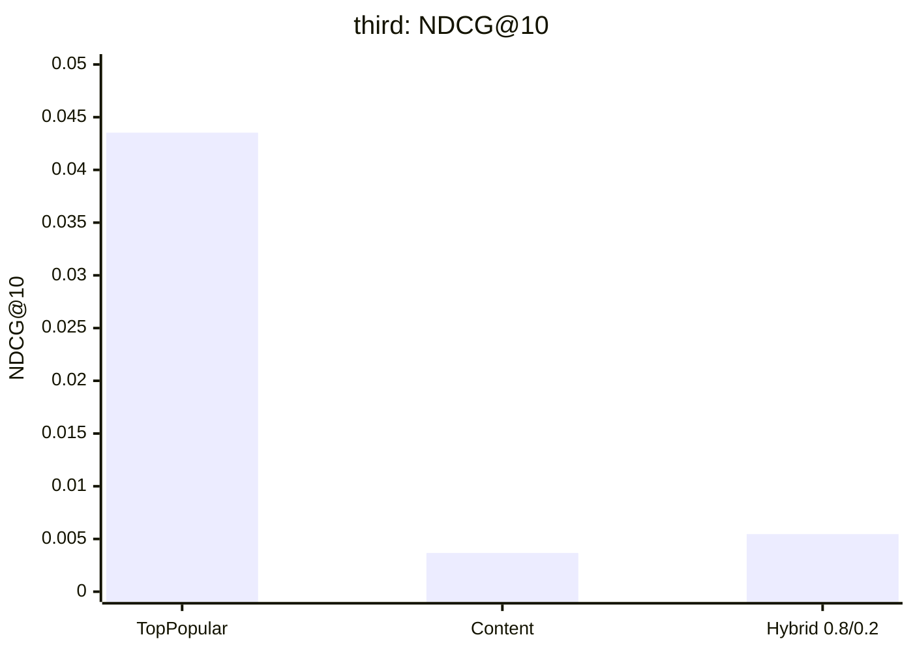
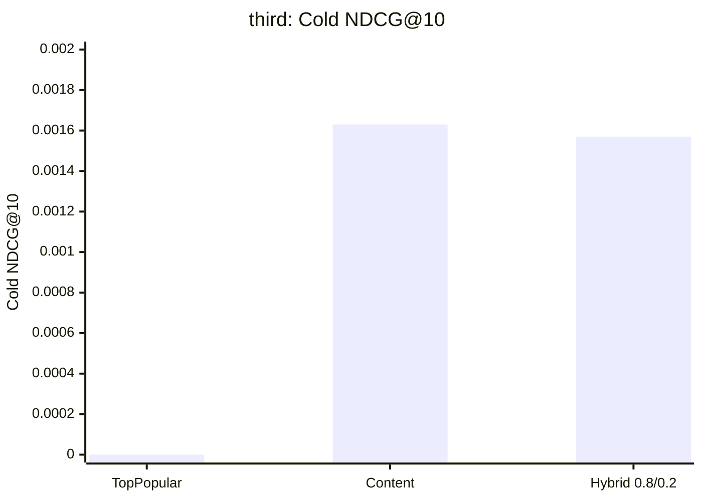
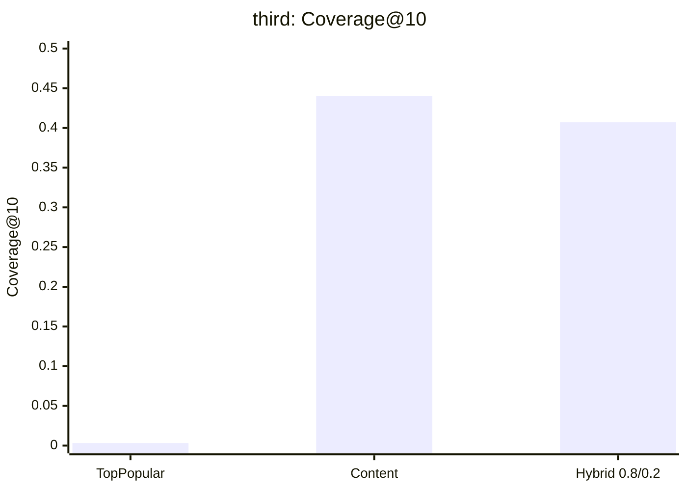

# Research Results (RecSys, Goodreads YA)

Ниже короткий итог по `research`-этапу: сравнение baseline / content / hybrid на нескольких прогонах (`first`, `second`, `third`).

## Что сравнивали

- `TopPopular` — сильный baseline для warm-item рекомендаций
- `Content TF-IDF` — контентная модель для cold items
- `Hybrid (content + popular)` — смешивание сигналов для баланса `overall` и `cold`

## Срезы экспериментов

- `first` — быстрый research-срез (`keep_recent_fraction=0.05`, `k_core=5`)
- `second` — тюнинг параметров на том же быстром срезе
- `third` — большой прогон (полный research-preprocess, `keep_recent_fraction=0.6`, `k_core=2`)

## Ключевой вывод (коротко)

- `TopPopular` стабильно лучший по `overall` (`NDCG@10`, `Recall@10`), но полностью провален на `cold` (`0.0`).
- `Content TF-IDF` дает ненулевые `cold`-метрики и очень высокое покрытие (`coverage`), но слабее по `overall`.
- `Hybrid` — правильное направление: лучше `content-only` по `overall`, при этом сохраняет cold-start поведение.

## Сравнение моделей (main runs)

### `first` (быстрый срез)

| Модель | NDCG@10 | Recall@10 | Coverage@10 | Cold NDCG@10 | Cold Recall@10 | Eval Users | Cold Eval Users |
|---|---:|---:|---:|---:|---:|---:|---:|
| TopPopular | 0.03290 | 0.04718 | 0.00109 | 0.00000 | 0.00000 | 46,091 | 1,603 |
| Content TF-IDF | 0.00672 | 0.01223 | 0.39171 | 0.00621 | 0.00972 | 46,091 | 1,603 |
| Hybrid (0.8/0.2) | 0.01009 | 0.01994 | 0.36549 | 0.00621 | 0.00972 | 46,091 | 1,603 |

### `second` (тюнинг на быстром срезе)

| Модель | NDCG@10 | Recall@10 | Coverage@10 | Cold NDCG@10 | Cold Recall@10 |
|---|---:|---:|---:|---:|---:|
| Content TF-IDF (`top500`) | 0.00672 | 0.01223 | 0.39173 | 0.00621 | 0.00972 |
| Hybrid `0.7/0.3` | **0.01305** | **0.02610** | 0.33933 | 0.00604 | 0.00972 |
| Hybrid `0.7/0.3 top500` | 0.01247 | 0.02488 | 0.34655 | 0.00602 | 0.00972 |

Итог по `second`: увеличение candidate list почти не помогло, а лучший компромисс на быстром срезе дал `Hybrid 0.7/0.3`.

### `third` (большой прогон, основной ориентир)

| Модель | NDCG@10 | Recall@10 | Coverage@10 | Cold NDCG@10 | Cold Recall@10 | Eval Users | Cold Eval Users |
|---|---:|---:|---:|---:|---:|---:|---:|
| TopPopular | **0.04353** | **0.05593** | 0.00329 | 0.00000 | 0.00000 | 167,105 | 29,399 |
| Content TF-IDF | 0.00367 | 0.00611 | **0.44017** | **0.00163** | **0.00315** | 167,105 | 29,399 |
| Hybrid (0.8/0.2) | 0.00546 | 0.00944 | 0.40708 | 0.00157 | 0.00301 | 167,105 | 29,399 |

## Графики (Mermaid)

### `third`: Overall качество (`NDCG@10`)

### `third`: Cold качество (`Cold NDCG@10`)

### `third`: Покрытие (`Coverage@10`)

## Что это значит по-простому

- `TopPopular` хорошо ранжирует популярные книги и дает сильный `overall`, но для новых/холодных книг бесполезен.
- `Content TF-IDF` заметно расширяет покрытие каталога и умеет рекомендовать cold items.
- `Hybrid` уже улучшает `overall` относительно `content-only`, но текущая версия `0.8/0.2` на большом срезе еще не лучший вариант.
- На быстром срезе (`second`) лучший компромисс показал `Hybrid 0.7/0.3`, поэтому его стоит переносить в следующий этап (`model/`) как основной MVP-кандидат.

## Что переносим дальше в production-like pipeline (`model/`)

- Общий `evaluator` с `overall/warm/cold` метриками
- `TopPopular` как baseline
- `Content TF-IDF` как cold-aware компонент
- `Hybrid` (с дальнейшим тюнингом весов, начиная с `0.7/0.3`)

## Где лежат исходные результаты

- `research/results/first/*_metrics.json`
- `research/results/second/*_metrics.json`
- `research/results/third/*_metrics.json`
- `research/notebooks/metrics_comparison.ipynb`
